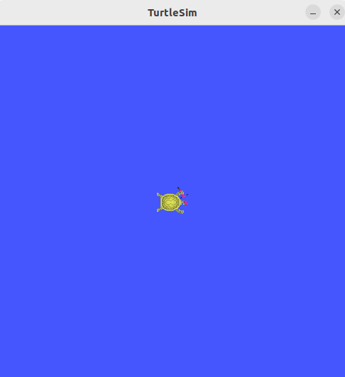
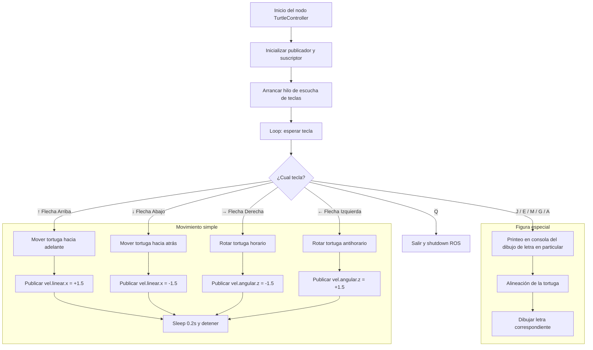
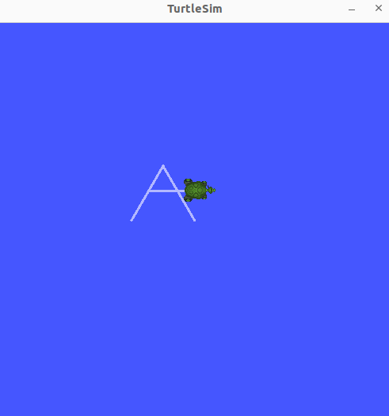
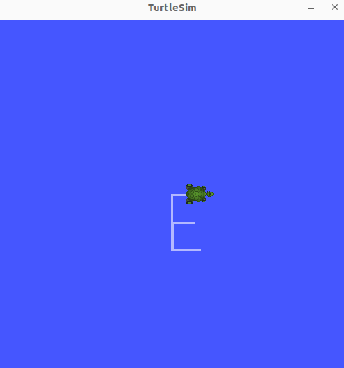
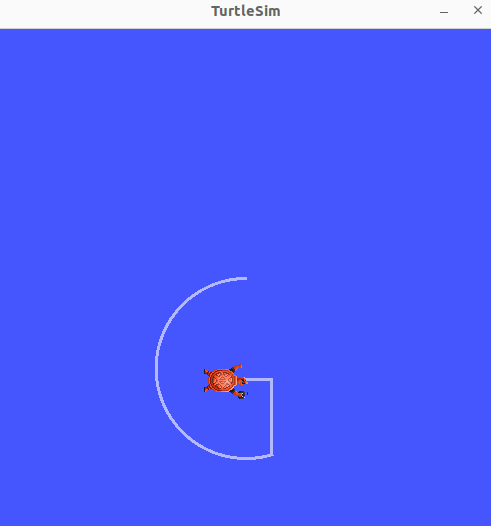
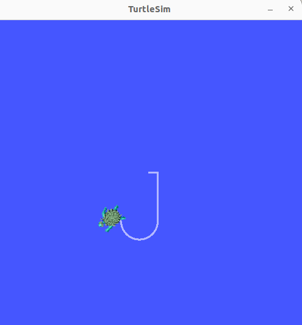
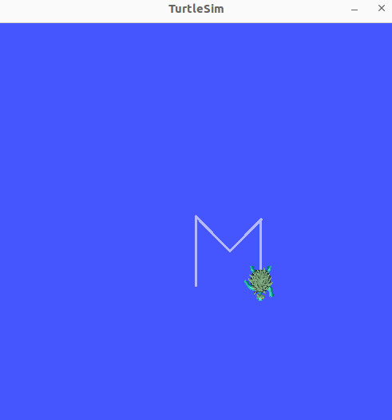

# Laboratorio Turtlesim

## Introducción del laboratorio
---

El objetivo del presente laboratorio es controlar el movimiento de la tortuga generada por `turtlesim` mediante teclado de dos formas distintas:
  1. Con flechas predefinidas de teclado moverla de forma lineal y angular.
  2. Con flechas respectivas a las iniciales nuestras, dibujar una letra predefinida.

Las flechas predefinidas a los movimientos lineales y angulares son "flecha arriba" para avance frontal y "flecha abajo" para retroceso. Por otro lado, "flecha izquierda" será para giro antihorario y "flecha derecha" será para giro horario.
Dado que nuestras iniciales son "J", "E", "M", "G" y "A", las teclas letradas respectivas se usaran para cada una de las figuras personalizadas.

## Procedimiento en términal (Ejecución)
---

En primer lugar se ubica uno en la carpeta respectiva de ROS 2:

'''base
$ cd ~/ros2_ws
'''

Se prepara el entorno de la terminal para abrir la ventana de la tortuga de la siguiente forma:

```bash
$ source /opt/ros/humble/setup.bash 
```

Donde `source` es un comando built-in de la shell, que ejecuta los comandos dentro de un archivo especificado cuya dirección se especifica en seguida (es decir, el archivo con ruta `/opt/ros/humble/setup.bash`). El archivo `setup.bash`, entonces, es un script que añade las rutas de los ejecutables de ROS 2 (como `ros2`, `colcon`) al path (al terminal para su uso), las rutas de las bibliotecas de ROS 2, las rutas de los paquete de Python para ROS 2.

Se ejecuta otro comando de la shell:

```bash
$ source install/setup.bash
```
El cual es un comando que el script `setup.bash` del directorio `install` del workspace local, y añade las rutas de los ejecutables, bibliotecas, módulos de python del dicho directorio a las variables de entorno modificadas en el anterior comando.

Ya finalmente se puede ejecutar el siguiente comando, el cual crea el nodo de la tortuguita y al muestra en una ventana:

```bash
$ ros2 run turtlesim turtlesim_node
```

En esta línea, `ros2 run` se utiliza para correr un ejecutable (nodo) del workspace, y `turtlesim` es el nombre del paquete de ROS 2 que contiene dicho nodo a ejecutar, en particular el nodo `turtlesim_node`. Al ejecutar este último nodo, se inicia la simulación de la tortuga, apareciendo una ventana gráfica con una tortuga:

<p align="center">
  
</p>

Es necesario ahora tener la capacidad de controlar el movimiento de la tortuga por medio de la ejecución de otro nodo, como por ejemplo `turtle_teleop_key` el cual permite controlar la tortuga con teclas predefinidas. Sin embargo, dado que queremos realizar formas y control particular desde script, se ejecutará un código de Python llamado `move_turtle.py`.

Se ejecuta este último de la siguiente forma, por necesidad en una nueva terminal:

```bash
$ source /opt/ros/humble/setup.bash
$ source install/setup.bash
$ colcon build
$ ros2 run my_turtle_controller move_turtle
```
Obsérvese que se prepara el entorno para ROS 2 de la misma forma que en el otro terminal, y además se ejecuta la herramienta `colcon` con el subcomando `build`, lo cual compila los paquetes de ROS 2 que se encuentran en el espacio de trabajo actual. El paquete `my_turtle_controller` se edita por medio de vsc, y ya habiendo ejecutado esta serie de comandos se puede controlar la tortuga por medio de las teclas indicadas y con el desempeño deseado.

## Estructura del script `move_turtle.py`
---

No se muestra todo el código aquí como uno solo dado que se puede ver de la misma forma en los archivos adjuntos en el repositorio. Sin embargo, se describirá parte por parte lo que hace cada bloque de código en seguida, con una explicación detallada.

### Código `mover_turtle.py`: Importaciones
```Python
import rclpy
from rclpy.node import Node
from geometry_msgs.msg import Twist
from turtlesim.msg import Pose
import threading
import time
import math
import sys
import tty
import termios
```
En primer lugar se importan los módulos de ROS 2 a utilizar con el fin de poder programar el nodo, y estos módulos corresponden a `rclpy` para Python y `Node` para la configuración de nodos. Se importan también los módulos respectivos de ROS 2 para movimiento (`Twist`) y posición (`Pose`).

Luego se importa `threading` que permite programar de forma que las entradas del teclado puedan pulsarse en paralelo (no solo una a la vez). Las demás librerías son `time` que es para control de retardos, `math` para todo tipo de cálclulos y los últimos tres (`sys`, `tty` y `termios`) son para comunicación del teclado con la terminal activa desde la cual se va a ejecutar el nodo de movimiento.

### Código `mover_turtle.py`: Clase `TurtleController`
---

Se hace una herencia de la librería `Node` con el fin de usarla para crear el nodo para controlar la tortuga. De dicha clase primero se da el bloque `__init__`

```Python
def __init__(self):
    super().__init__('turtle_controller')
    self.publisher_ = self.create_publisher(Twist, '/turtle1/cmd_vel', 10)
    self.theta = 0.0
    self.lock = threading.Lock()
    self.pose_subscriber = self.create_subscription(Pose, '/turtle1/pose', self.actualizar_pose, 10)
    self.running = True
    self.input_thread = threading.Thread(target=self.escuchar_teclas)
    self.input_thread.daemon = True
    self.input_thread.start()
```

En la cual se declara el nombre del nodo como `turtle_controller`, se declara un publicador para enviar comandos de velocidad (`/turtle/cmd/vel`) y un suscriptor que recibirá la pose de la tortuga (`/turtle/pose`) y actualiza `self.theta` (que corresponde a la variable de orientación). Finalmente se indica que se inicie un hilo en segundo plano que constantemente detecte el teclado para leer las entradas del usuario, llamando a dicho hilo `escuchar_teclas`.

### Funciones de la clase `TurtleCOntroller`
---

#### Función: `actualizar_pose`

Ya habiendo definido las características de la clase, ahora se declaran las funciones asociadas a la clase del nodo de controlador de la tortuga. La primera de ellas se llama `actualizar_pose`:

```Python
def actualizar_pose(self, msg):
    self.theta = msg.theta
    with self.lock:
        self.theta = msg.theta
```

Bloque de código el cual simplemente actualiza `self.theta`, que es el valor actual del ángulo de la tortuga. Nótese que se utiliza un `lock` para evitar condiciones de carrera (es decir, para evitar que se acceda al control de ángulo mientras ya está siendo controlado por un proceso). 

#### Función: `escuchar_teclas'

Se declara otra función llamada `escuchar_teclas` que va a ser la cabeza de la operación funcional de todo el código, pues este va a llamar a las demás funciones de la clase. Se evidencia en este el diagrama de flujo general del script:

```Python
    def escuchar_teclas(self):
        print("Controles:")
        print("  j - Dibujar letra J (alineada automáticamente)")
        print("  Flechas - Mover la tortuga (↑ ↓ ← →)")
        print("  q - Salir")
        while self.running:
            tecla = self.get_key()
            if tecla == 'j':
                self.get_logger().info("Dibujando la letra J...")
                self.alinear_tortuga(-math.pi / 2)  # Apuntar hacia abajo
                self.dibujar_letra_j()
            elif tecla == 'e':
                self.get_logger().info("Dibujando la letra E...")
                self.alinear_tortuga(-math.pi / 2)
                self.dibujar_letra_e()
            elif tecla == 'm':
                self.get_logger().info("Dibujando la letra M...")
                self.alinear_tortuga(-math.pi / 2)
                self.dibujar_letra_m()
            elif tecla == 'g':
                self.get_logger().info("Dibujando la letra G...")
                self.alinear_tortuga(-math.pi / 2)
                self.dibujar_letra_g()
            elif tecla == 'a':
                self.get_logger().info("Dibujando la letra A...")
                self.alinear_tortuga(-math.pi / 2)
                self.dibujar_letra_a()        
            elif tecla == '\x1b[A':  # Flecha arriba
                self.mover_tortuga(1.5, 0.0)
            elif tecla == '\x1b[B':  # Flecha abajo
                self.mover_tortuga(-1.5, 0.0)
            elif tecla == '\x1b[C':  # Flecha derecha
                self.mover_tortuga(0.0, -1.5)
            elif tecla == '\x1b[D':  # Flecha izquierda
                self.mover_tortuga(0.0, 1.5)
            elif tecla == 'q':
                print("Saliendo...")
                self.running = False
                rclpy.shutdown()
```
Las líneas de printeo ayudarán a indicar en la terminal que se está ejecutando el proceso e indica las teclas con función. Como se ve, comienza un proceso permanente de escucha por medio de la función `get_key()`, definida más adelante. Si `get_key()` detecta algo comenzará a verificar a cuál de los casos corresponde. Solo se incluyen los casos de interés (es decir, los de los objetivos: las teclas correspondientes a las letras iniciales de nuestros nombres y las de moiviento lineal y angular, que son las flechas). Obsérvese que si se recibe una tecla que no se contempla dentro de los condicionales no ocurrirá nada, y si recibe la letra "q" entonces va a terminar el proceso del nodo (es decir, se cerrará el programa). Los demás condicionales se encargan de lo siguiente dependiendo de si es una tecla para dibujar una letra o para ejecutar un movimiento simple:
  
  * Las teclas que ejecutan movimientos sencillos corresponden a las felchas, que en codificación se nombran `\x1b[A`, `\x1b[B`, `\x1b[C` y `\x1b[D`, van a llamar a la función `mover_tortuga` definida más adelante con parámetros de entrada iguales.
  
  * Las teclas de dibujo de letra primero prntean en la terminal que una letra en particular se está escribiendo. Luego preparan a la tortuga, posicionándola en un sentido recto hacia arriba, puesto que los parámetros de movimiento de la tortuga son relativos a su orientación actual. Y finalmente, llama a la función respectiva de la letra para dibujarla.

Se ve este proceso de forma resumida en el siguiente diagrama de flujo realizado en `mermaid`:



#### Función: `get_key`

```Python
def get_key(self):
        fd = sys.stdin.fileno()
        old_settings = termios.tcgetattr(fd)
        try:
            tty.setraw(fd)
            ch1 = sys.stdin.read(1)
            if ch1 == '\x1b':
                ch2 = sys.stdin.read(1)
                ch3 = sys.stdin.read(1)
                return ch1 + ch2 + ch3
            else:
                return ch1
        finally:
            termios.tcsetattr(fd, termios.TCSADRAIN, old_settings)
```
Esta función utiliza las librerías de `termios` y `tty` para leer las teclas en tiempo real. La estructura de este código es consecuencia del uso de la librería.

#### Función: `mover_tortuga` y `detener`

```Python
def mover_tortuga(self, lin_x, ang_z):
        msg = Twist()
        msg.linear.x = lin_x
        msg.angular.z = ang_z
        self.publisher_.publish(msg)
        time.sleep(0.2)
        self.detener()
#...
#Más adelante en el código
def detener(self):
        msg = Twist()
        msg.linear.x = 0.0
        msg.angular.z = 0.0
        self.publisher_.publish(msg)

```
Obsérvese que para el movimiento se utiliza la importación de `twist` y mediante el conocimiento de la librería se varían los parámetros de objeto según sean las entrada, ya predefinidas de giro y desplazamiento, en el bloque de código cabeza. En general, estos dos bloques de código publican comandos de movimiento y luego detienen la tortuga para movimientos discretos.

#### Función: `alinear_tortuga`

```Python
    def alinear_tortuga(self, angulo_objetivo):
        tolerancia = 0.001
        max_duracion = 15
        velocidad = 0.2

        start_time = time.time()
        while rclpy.ok() and (time.time() - start_time) < max_duracion:
            with self.lock:
                error = self._normalizar_angulo(angulo_objetivo - self.theta)

            if abs(error) < tolerancia:
                break

            msg = Twist()
            msg.angular.z = velocidad if error > 0 else -velocidad
            self.publisher_.publish(msg)
            time.sleep(0.05)

        self.detener()
```
Este bloque de código modifica juega con los comandos de movimiento importados para girar la tortuga un ángulo específico, que se mantiene constante en el código de cabecera. Depende de otra función de normalizaación matemática:

```Python
    def _normalizar_angulo(self, angulo):
        return math.atan2(math.sin(angulo), math.cos(angulo))
```

#### Función: `mover` y `girar`

Estas funciones se distinguen de las anteriores y son especiales para el dibujo de las letras dado que permiten llamar y ejecutar movimientos de forma continua en la tortuga, sin los cuales sería muy largo con las demás funciones:

```Python
    def mover(self, lin_x, ang_z, duracion):
        msg = Twist()
        msg.linear.x = lin_x
        msg.angular.z = ang_z
        tiempo_inicial = self.get_clock().now().seconds_nanoseconds()[0]
        while self.get_clock().now().seconds_nanoseconds()[0] - tiempo_inicial < duracion:
            self.publisher_.publish(msg)
            time.sleep(0.1)
```
Observe que el bloque 'while' es el que, por medio de un reloj de ROS 2, contabiliza para ejecutar el movimiento. Publica un mensaje `Twist`repetidamente y no detiene la tortuga automaticamente como en la otra función de `mover_tortuga`. El caso de la función `girar` no es tan distinto:

```Python
def girar(self, angulo):
        msg = Twist()
        if angulo > 0:
            msg.angular.z = 1.5
        else:
            msg.angular.z = -1.5
        tiempo = abs(angulo) / 1.5
        t0 = time.time()
        while time.time() - t0 < tiempo:
            self.publisher_.publish(msg)
            time.sleep(0.1)
        self.detener()
```
### Funciones de dibujo de letras

En seguida se muestran las funciones respectivas para cada una de las letras. No se dará mayor explicación sobre el motivo de cada línea, pues fueron ajustándose según era la intención que el dibujo cumpliese con la forma. Usan todas las funciones anteriormente descritas y busca, cada una, con su estructura, darle una apariencia satisfactoria a las letras.

```Python
def dibujar_letra_j(self):
        self.mover(1.5, 0.0, 2)      # Hacia abajo
        self.mover(1.0, -1.5, 1.5)   # Curva derecha
        self.mover(0.5, 2.0, 1)      # Gancho
        self.detener()
    
    def dibujar_letra_e(self):
        # Línea vertical
        self.mover_tortuga(10.0,0.0)
        self.detener()
        time.sleep(0.2)

        # Infeior horizontal
        self.alinear_tortuga(0.0)
        self.mover_tortuga(5.0,0.0)
        self.detener()
        time.sleep(0.2)

        # Regresar al medio
        self.mover_tortuga(-4.5, 0.0)
        self.alinear_tortuga(-math.pi / 2)
        self.mover_tortuga(-5.0, 0.0)
        self.alinear_tortuga(0)
        self.mover_tortuga(4.0, 0.0)
        self.detener()
        time.sleep(0.2)

        # Regresar al centro base y trazar línea superior
        self.mover_tortuga(-3.8, 0.0)
        self.alinear_tortuga(-math.pi / 2)
        self.mover_tortuga(-5.0, 0.0)
        self.alinear_tortuga(0)
        self.mover_tortuga(5.0, 0.0)
        self.detener()


    def dibujar_letra_m(self):
        # Línea izquierda
        self.mover_tortuga(10.0, 0.0)
        self.detener()
        time.sleep(0.2)

        # Regresar y dibujar la primera diagonal
        self.mover_tortuga(-10.0, 0.0)
        self.alinear_tortuga(-(math.pi/4))
        self.mover_tortuga(7.0, 0.0)
        self.detener()
        time.sleep(0.2)

        # Segunda diagonal
        self.alinear_tortuga((math.pi/4))
        self.mover_tortuga(7.0, 0.0)
        self.detener()
        time.sleep(0.2)

        # Línea derecha
        self.alinear_tortuga(-(math.pi/2))
        self.mover_tortuga(10.0, 0.0)
        self.detener()


      def dibujar_letra_g(self):
        self.alinear_tortuga(math.pi)
        time.sleep(0.2)

        #Dibujar media circunferencia ("C" curva)
        for _ in range(17):  # Hacemos varios pequeños movimientos para formar la curva
            self.mover_tortuga(2.0, 1.0)
            time.sleep(0.1)
        self.detener()
        time.sleep(0.2)

        #Orientar
        self.alinear_tortuga(-(math.pi/2))
        time.sleep(0.2)

        #Pequeño avance hacia arriba
        self.mover_tortuga(-8.0, 0.0)
        time.sleep(0.1)
        self.detener()
        time.sleep(0.2)

        #Orientar
        self.alinear_tortuga(0)
        time.sleep(0.2)

        #Avance a la izquireda
        self.mover_tortuga(-5.0, 0.0)
        time.sleep(0.1)
        self.detener()


    def dibujar_letra_a(self):
        # Gira y dibuja pierna izquierda
        self.alinear_tortuga(-(math.pi /3))
        self.mover_tortuga(-10.0, 0.0)
        self.detener()
        time.sleep(0.2)

        # Gira y dibuja pierna derecha
        self.alinear_tortuga((math.pi/3))
        self.mover_tortuga(-10.0, 0.0)
        self.detener()
        time.sleep(0.2)

        # Línea horizontal al medio
        self.mover_tortuga(5.0, 0.0)
        self.alinear_tortuga(0)
        self.mover_tortuga(8.0,0.0)
        self.detener()
```


## Resultados
---

Para la letra "A" se obtiene el siguiente resultado:

<p align="center">
  
</p>

Para la letra "E":

<p align="center">
  
</p>

Para la letra "G":

<p align="center">
  
</p>

Para la letra "J":

<p align="center">
  
</p>

Para la letra "M":

<p align="center">
  
</p>

Se excluye la muestra de los movimientos lineales y los de giro, ya que se consideran triviales y se pueden mostrar de mejor forma en el video.
