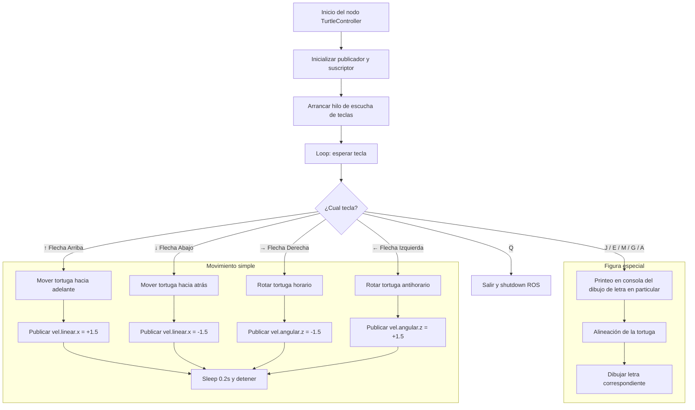

# Laboratorio RobotStudio

## Introducción del laboratorio
---

El objetivo del presente laboratorio es por medio de simulación y RAPID en un ABB IRB-140:
  1. Dibujar el primer nombre de cada integrante, de forma separada, sobre una torta con un tamaño correspondiente a 20 personas aproximadamente.
  2. Hacer el objetivo anterior de forma que primero se lleve la torta sobre una banda transportadora, la desplace hasta el robot, y tan pronto este útlimo termine el dibujo desplace la torta otra vez con la banda transportadora.

En relación a estos objetivos, se hacen unas observaciones adicionales. Primero, debido a limitaciones de tiempo y disponibilidad del laboratorio, se restringe el movimiento de la banda transportadora solo a la simulación de RobotStudio. Por otra parte, este laboratorio inició con tres integrantes, pero poco tiempo después de su inició el tercer compañero abandonó; se realizó parte del código RAPID para dibujar el nombre del compañero pero no se continuó, debido a la innecesidad. Finalmente, se adecuó el espacio de dibujo en la prueba real y por los implementos usados se dio cierta inclinación que influye en el dibujo final, que se explicará su motivo en uno de los apartados siguientes.

## Procedimiento, Parte #1: Diseño de herramienta
---

Se dispone de las siguientes herramientas en el laboratorio:
  - Un manipulador industrial IRB-140 de la marca ABB.
  - Un controlador IRC5 con un módulo de distribución de energía 3HAC025917-001/00 DSQC 652.
  - Un RobotTeach Pendent de ABB modelo 3HACO28357—001 para el controlador IRC5.


### Funciones de la clase `TurtleCOntroller`
---

#### Función: `actualizar_pose`

Ya habiendo definido las características de la clase, ahora se declaran las funciones asociadas a la clase del nodo de controlador de la tortuga. La primera de ellas se llama `actualizar_pose`:

```Python
def actualizar_pose(self, msg):
    self.theta = msg.theta
    with self.lock:
        self.theta = msg.theta
```

Bloque de código el cual simplemente actualiza `self.theta`, que es el valor actual del ángulo de la tortuga. Nótese que se utiliza un `lock` para evitar condiciones de carrera (es decir, para evitar que se acceda al control de ángulo mientras ya está siendo controlado por un proceso). 

#### Función: `escuchar_teclas'

Se declara otra función llamada `escuchar_teclas` que va a ser la cabeza de la operación funcional de todo el código, pues este va a llamar a las demás funciones de la clase. Se evidencia en este el diagrama de flujo general del script:

```Python
    def escuchar_teclas(self):
        print("Controles:")
        print("  j - Dibujar letra J (alineada automáticamente)")
        print("  Flechas - Mover la tortuga (↑ ↓ ← →)")
        print("  q - Salir")
        while self.running:
            tecla = self.get_key()
            if tecla == 'j':
                self.get_logger().info("Dibujando la letra J...")
                self.alinear_tortuga(-math.pi / 2)  # Apuntar hacia abajo
                self.dibujar_letra_j()
            elif tecla == 'e':
                self.get_logger().info("Dibujando la letra E...")
                self.alinear_tortuga(-math.pi / 2)
                self.dibujar_letra_e()
            elif tecla == 'm':
                self.get_logger().info("Dibujando la letra M...")
                self.alinear_tortuga(-math.pi / 2)
                self.dibujar_letra_m()
            elif tecla == 'g':
                self.get_logger().info("Dibujando la letra G...")
                self.alinear_tortuga(-math.pi / 2)
                self.dibujar_letra_g()
            elif tecla == 'a':
                self.get_logger().info("Dibujando la letra A...")
                self.alinear_tortuga(-math.pi / 2)
                self.dibujar_letra_a()        
            elif tecla == '\x1b[A':  # Flecha arriba
                self.mover_tortuga(1.5, 0.0)
            elif tecla == '\x1b[B':  # Flecha abajo
                self.mover_tortuga(-1.5, 0.0)
            elif tecla == '\x1b[C':  # Flecha derecha
                self.mover_tortuga(0.0, -1.5)
            elif tecla == '\x1b[D':  # Flecha izquierda
                self.mover_tortuga(0.0, 1.5)
            elif tecla == 'q':
                print("Saliendo...")
                self.running = False
                rclpy.shutdown()
```
Las líneas de printeo ayudarán a indicar en la terminal que se está ejecutando el proceso e indica las teclas con función. Como se ve, comienza un proceso permanente de escucha por medio de la función `get_key()`, definida más adelante. Si `get_key()` detecta algo comenzará a verificar a cuál de los casos corresponde. Solo se incluyen los casos de interés (es decir, los de los objetivos: las teclas correspondientes a las letras iniciales de nuestros nombres y las de moiviento lineal y angular, que son las flechas). Obsérvese que si se recibe una tecla que no se contempla dentro de los condicionales no ocurrirá nada, y si recibe la letra "q" entonces va a terminar el proceso del nodo (es decir, se cerrará el programa). Los demás condicionales se encargan de lo siguiente dependiendo de si es una tecla para dibujar una letra o para ejecutar un movimiento simple:
  
  * Las teclas que ejecutan movimientos sencillos corresponden a las felchas, que en codificación se nombran `\x1b[A`, `\x1b[B`, `\x1b[C` y `\x1b[D`, van a llamar a la función `mover_tortuga` definida más adelante con parámetros de entrada iguales.
  
  * Las teclas de dibujo de letra primero prntean en la terminal que una letra en particular se está escribiendo. Luego preparan a la tortuga, posicionándola en un sentido recto hacia arriba, puesto que los parámetros de movimiento de la tortuga son relativos a su orientación actual. Y finalmente, llama a la función respectiva de la letra para dibujarla.

Se ve este proceso de forma resumida en el siguiente diagrama de flujo realizado en `mermaid`:



#### Función: `get_key`

```Python
def get_key(self):
        fd = sys.stdin.fileno()
        old_settings = termios.tcgetattr(fd)
        try:
            tty.setraw(fd)
            ch1 = sys.stdin.read(1)
            if ch1 == '\x1b':
                ch2 = sys.stdin.read(1)
                ch3 = sys.stdin.read(1)
                return ch1 + ch2 + ch3
            else:
                return ch1
        finally:
            termios.tcsetattr(fd, termios.TCSADRAIN, old_settings)
```
Esta función utiliza las librerías de `termios` y `tty` para leer las teclas en tiempo real. La estructura de este código es consecuencia del uso de la librería.

#### Función: `mover_tortuga` y `detener`

```Python
def mover_tortuga(self, lin_x, ang_z):
        msg = Twist()
        msg.linear.x = lin_x
        msg.angular.z = ang_z
        self.publisher_.publish(msg)
        time.sleep(0.2)
        self.detener()
#...
#Más adelante en el código
def detener(self):
        msg = Twist()
        msg.linear.x = 0.0
        msg.angular.z = 0.0
        self.publisher_.publish(msg)

```
Obsérvese que para el movimiento se utiliza la importación de `twist` y mediante el conocimiento de la librería se varían los parámetros de objeto según sean las entrada, ya predefinidas de giro y desplazamiento, en el bloque de código cabeza. En general, estos dos bloques de código publican comandos de movimiento y luego detienen la tortuga para movimientos discretos.

#### Función: `alinear_tortuga`

```Python
    def alinear_tortuga(self, angulo_objetivo):
        tolerancia = 0.001
        max_duracion = 15
        velocidad = 0.2

        start_time = time.time()
        while rclpy.ok() and (time.time() - start_time) < max_duracion:
            with self.lock:
                error = self._normalizar_angulo(angulo_objetivo - self.theta)

            if abs(error) < tolerancia:
                break

            msg = Twist()
            msg.angular.z = velocidad if error > 0 else -velocidad
            self.publisher_.publish(msg)
            time.sleep(0.05)

        self.detener()
```
Este bloque de código modifica juega con los comandos de movimiento importados para girar la tortuga un ángulo específico, que se mantiene constante en el código de cabecera. Depende de otra función de normalizaación matemática:

```Python
    def _normalizar_angulo(self, angulo):
        return math.atan2(math.sin(angulo), math.cos(angulo))
```

### Funciones de dibujo de letras

En seguida se muestran las funciones respectivas para cada una de las letras. No se dará mayor explicación sobre el motivo de cada línea, pues fueron ajustándose según era la intención que el dibujo cumpliese con la forma. Usan todas las funciones anteriormente descritas y busca, cada una, con su estructura, darle una apariencia satisfactoria a las letras.

```Python
def dibujar_letra_j(self):
        self.mover(1.5, 0.0, 2)      # Hacia abajo
        self.mover(1.0, -1.5, 1.5)   # Curva derecha
        self.mover(0.5, 2.0, 1)      # Gancho
        self.detener()
    
    def dibujar_letra_e(self):
        # Línea vertical
        self.mover_tortuga(10.0,0.0)
        self.detener()
        time.sleep(0.2)

        # Infeior horizontal
        self.alinear_tortuga(0.0)
        self.mover_tortuga(5.0,0.0)
        self.detener()
        time.sleep(0.2)

        # Regresar al medio
        self.mover_tortuga(-4.5, 0.0)
        self.alinear_tortuga(-math.pi / 2)
        self.mover_tortuga(-5.0, 0.0)
        self.alinear_tortuga(0)
        self.mover_tortuga(4.0, 0.0)
        self.detener()
        time.sleep(0.2)

        # Regresar al centro base y trazar línea superior
        self.mover_tortuga(-3.8, 0.0)
        self.alinear_tortuga(-math.pi / 2)
        self.mover_tortuga(-5.0, 0.0)
        self.alinear_tortuga(0)
        self.mover_tortuga(5.0, 0.0)
        self.detener()


    def dibujar_letra_m(self):
        # Línea izquierda
        self.mover_tortuga(10.0, 0.0)
        self.detener()
        time.sleep(0.2)

        # Regresar y dibujar la primera diagonal
        self.mover_tortuga(-10.0, 0.0)
        self.alinear_tortuga(-(math.pi/4))
        self.mover_tortuga(7.0, 0.0)
        self.detener()
        time.sleep(0.2)

        # Segunda diagonal
        self.alinear_tortuga((math.pi/4))
        self.mover_tortuga(7.0, 0.0)
        self.detener()
        time.sleep(0.2)

        # Línea derecha
        self.alinear_tortuga(-(math.pi/2))
        self.mover_tortuga(10.0, 0.0)
        self.detener()


      def dibujar_letra_g(self):
        self.alinear_tortuga(math.pi)
        time.sleep(0.2)

        #Dibujar media circunferencia ("C" curva)
        for _ in range(17):  # Hacemos varios pequeños movimientos para formar la curva
            self.mover_tortuga(2.0, 1.0)
            time.sleep(0.1)
        self.detener()
        time.sleep(0.2)

        #Orientar
        self.alinear_tortuga(-(math.pi/2))
        time.sleep(0.2)

        #Pequeño avance hacia arriba
        self.mover_tortuga(-8.0, 0.0)
        time.sleep(0.1)
        self.detener()
        time.sleep(0.2)

        #Orientar
        self.alinear_tortuga(0)
        time.sleep(0.2)

        #Avance a la izquireda
        self.mover_tortuga(-5.0, 0.0)
        time.sleep(0.1)
        self.detener()


    def dibujar_letra_a(self):
        # Gira y dibuja pierna izquierda
        self.alinear_tortuga(-(math.pi /3))
        self.mover_tortuga(-10.0, 0.0)
        self.detener()
        time.sleep(0.2)

        # Gira y dibuja pierna derecha
        self.alinear_tortuga((math.pi/3))
        self.mover_tortuga(-10.0, 0.0)
        self.detener()
        time.sleep(0.2)

        # Línea horizontal al medio
        self.mover_tortuga(5.0, 0.0)
        self.alinear_tortuga(0)
        self.mover_tortuga(8.0,0.0)
        self.detener()
```


## Resultados
---

Para la letra "A" se obtiene el siguiente resultado:

<p align="center">
  
</p>

Para la letra "E":

<p align="center">
  
</p>

Para la letra "G":

<p align="center">
  
</p>

Para la letra "J":

<p align="center">
  
</p>

Para la letra "M":

<p align="center">
  
</p>


### Presentación

[Link al video de la presentación en youtube.](https://youtu.be/41Mnf04L6z8)
