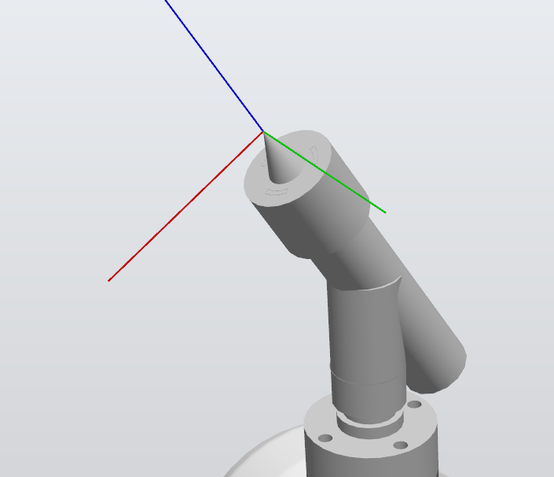

# Laboratorio RobotStudio

<p align="center">
  
</p>

## Introducción del laboratorio
---

El objetivo del presente laboratorio es por medio de simulación y RAPID en un ABB IRB-140:
  1. Diseñar un portaherramienta para el manipulador y emplearlo en el laboratorio.
  2. Dibujar el primer nombre de cada integrante, de forma separada, sobre una torta con un tamaño correspondiente a 20 personas aproximadamente.
  3. Hacer el objetivo anterior de forma que primero se lleve la torta sobre una banda transportadora, la desplace hasta el robot, y tan pronto este útlimo termine el dibujo desplace la torta otra vez con la banda transportadora.

En relación a estos objetivos, se hacen unas observaciones adicionales. Primero, debido a limitaciones de tiempo y disponibilidad del laboratorio, se restringe el movimiento de la banda transportadora solo a la simulación de RobotStudio. Por otra parte, este laboratorio inició con tres integrantes, pero poco tiempo después de su inició el tercer compañero abandonó; se realizó parte del código RAPID para dibujar el nombre del compañero pero no se continuó, debido a la innecesidad. Finalmente, se adecuó el espacio de dibujo en la prueba real y por los implementos usados se dio cierta inclinación que influye en el dibujo final, que se explicará su motivo en uno de los apartados siguientes. Por último, ni se emplea una torta real y tampoco un extrusor de confitura, sino un caja/tablero que hace de torta (con las dimensiones proporcionales) y un marcador que hace de extrusor.

## Procedimiento

### Preliminares
---

Se dispone de las siguientes herramientas en el laboratorio:
  - Un manipulador industrial IRB-140 de la marca ABB.
<p align="center">
  
</p>

  - Un controlador IRC5 con un módulo de distribución de energía 3HAC025917-001/00 DSQC 652.
  - Un RobotTeach Pendent de ABB modelo 3HACO28357—001 para el controlador IRC5.

<p align="center">
  
</p>

De los anteriores implementos, solo se deben tener en cuenta dos en particular: el controlador y el manipulador. Esto debido a que con sus modelos de computador se podrá trabajar en el módulo de RAPID dentro del workspace de RobotStudio. Dentro de RobotStudio se incluyen estos implementos, pero todavía hace falta el portaherramienta. El portaherramienta se puede obtener en físico dado un costo y su modelo también, aunque puede que encontrarlo tenga su dificultad; sin embargo, dados los requerimientos del laboratorio y facilidad de producción (manufactura aditiva), se diseña uno propio.


### Diseño del portaherramienta y torta con imprenta
---

Para el diseño de la herramienta, se consiguen marcadores comunes de la marca Pelikan y se extraen sus medidas haciendo uso de un pie de rey:

<p align="center">
  
</p>

Donde la medida coloreada en azul es de interés. Lo anterior se debe a que se busca emplear un resorte en la base del marcador como método de tolerancia para el dibujo con el marcador sobre el tablero, de forma que esa medida de la punta al cuerpo del portaherramienta (que va hasta el cuello del cuerpo del marcador) va a ir variando. Las demás medidas, en rojo, servirán para las dimensiones de encaje del marcador en el portaherramienta y su ajuste seguro.

El siguiente es un dibujo CAD, solo ilustriativo, del portaherramienta:

<p align="center">
  
</p>

<p align="center">
  
</p>

Antes de proceder, se destaca lo siguiente para el procedimiento: es posible dentro de RobotStudio definir paths a partir de puntos flotantes en el mismo entorno, pero es muy inexacto o bien consumiría , para dibujar los nombres. Existe, sin embargo, una ruta alternativa, más sencilla, rápida y exacta: importar un modelo de caja con los nombres impresos en ellas, y utilizar las herramientas de cursor y snap a esquinas/curvas/aristas para realizar paths exactos o por lo menos aproximados. Se realiza la siguiente imprenta sobre un modelo .sat de caja 20x20x10 (mm):

<p align="center">
  
</p>

Obsérvese que, con respecto al flange manipulador, hay 30 grados. De esta forma, se evitan singularidades (en las cuales el robot pierde grados de libertad), se evita pérdida de control fino y también movimientos no suaves.

Ya teniendo el modelo del portaherramienta y el modelo de la caja, se exportan de Inventor y se importan (de nuevo, como .sat) a RobotStudio. En este punto es necesario hacer algunos ajustes:
  1. RobotStudio, al importar estos modelos como cuerpos independientes, asigna sistemas coordenados a cada uno que sirve para referenciarlos (un sistema de coordenadas para que todo lo que se haga con o sobre ese cuerpo sea con respecto a una referencia única que reconoce un sistema de coordenadas universales)
  2. Este sistema de coordendas debe reubicarse para ambos cuerpos en función de su utilidad:
       - Para el caso del portaherramienta, se ubica en su parte inferior, donde se va a ajustar con el flange para herramientas del último eslabón del robot IRB-140. Esto, de forma que despúes de una configuración, se ajuste el sistema de coordenadas del portaherramienta con el sistema de coordenadas TCP que tiene el modelo del IRB-140 por defecto.

<p align="center">
  
</p>

       - Para el caso de la caja, se ubica en el workspace en cualquier lugar que resulte alcanzable y conveniente para el manipulador (se encuentre dentro de su espacio alcanzable, y si acaso luego se ajusta para su espacio diestro). Luego, se ubica el sistema de coordenadas de este objeto en un punto conveniente para definir los puntos para las trayectorias. En este caso, se ubica en la esquina de la cara superior más cercana al manipulador, de forma que todos los puntos tengan coordenadas con componentes positivas relativas al sistema coordenado de la torta.

<p align="center">
  
</p>

Antes de proceder, se hace un ajuste adicional: para el caso del portaherramiente, se debe todavía ajustar el sentido del TCP en la punta. Para esto, se ubica en la punta pero además de esto se rota y pone en la dirección necesaria para que al aproximarse al objeto no choque con este.

<p align="center">
  
</p>

Ya con esto, se tiene todo ajustado en RobotStudio y se puede a proceder a preparar el código para el módulo RAPID a usar con el robot en físico.

### Módulo RAPID y configuraciones adicionales de simulación

Por medio de la herramienta de creación de targets, se crean puntos sobre la imprenta que permitan crear trayectorias para dibujar cada una de las letras y la figura. Estos targets se crean en relación al sistema coordenado del WorkObject (el de la torta), de forma que se puede mover este y se muevan, con él, las trayectorias a realizar. Se crean las trayectorias y se modifican en el editor de RAPID de forma que cumplan las siguientes características:
  1. Velocidad de 100 (m/s), a escogencia propia, dado el rango especificado en la guía de laboratorio.
  2. Un error de máximo 10 mm con respecto a la trayectoria.
  3. Movimientos a partir del comando MoveJ en reemplazo de MoveL (para evitar singularidades y problemas), sumado a movimientos MoveC.

Se describe el código ahora de forma general.

### Descripción (resumida) del código:

El siguiente diagrama muestra el funcionamiento del módulo RAPID. Se destaca que únicamente mira la lógica entre las variables:


Se muestra otro diagrama de flujo equivalente que muestra el proceso funcional del programa, que puede ser superpuesto al anterior diagrama de flujo:


En caso de dificultad visualizando el texto en el diagrama de flujo, véase el texto:


```txt
flowchart TD
    A["Encendido de Robot"] --> B["Reset salidas digitales #1 para el led indicador de estado y #2 para el movimiento de la banda"]
    B --> C{"Se presionó el botón entrada digital de dibujado de la torta #1?"}
    C -- No --> J{"Botón entrada digital #2 activo, para la posición de mantenimiento?"}
    C -- Sí --> D["Poner ACTIVO salida digital para movimiento de la torta -> Esperar posicionamiento -> Apagar el movimiento -> Espera"]
    D --> E["Activar el dibujado"]
    E --> F["Llevar a Home"]
    F --> G["Dibujar los nombres"]
    G --> H["Dibujar la estrella e ir a home"]
    H --> I["Poner ACTIVO salida digital para movimiento de la torta -> Esperar posicionamiento -> Apagar el movimiento -> Espera"]
    I --> J
    J -- Sí --> K["Apagar el indicador de que está en proceso de dibujado el manipulador"]
    K --> L["Llevar a la posición de mantimiento"]
    L --> M["Vuelve al inicio del WHILE"]
    J -- No --> M
```

## Presentación

[Link al video de la presentación en youtube.](https://youtu.be/41Mnf04L6z8)
