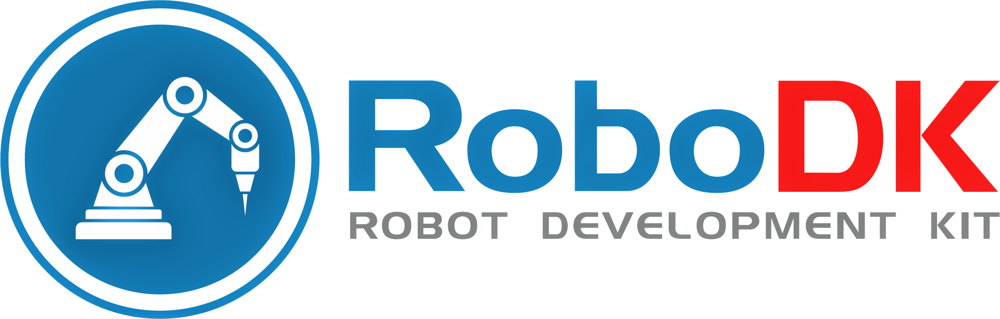
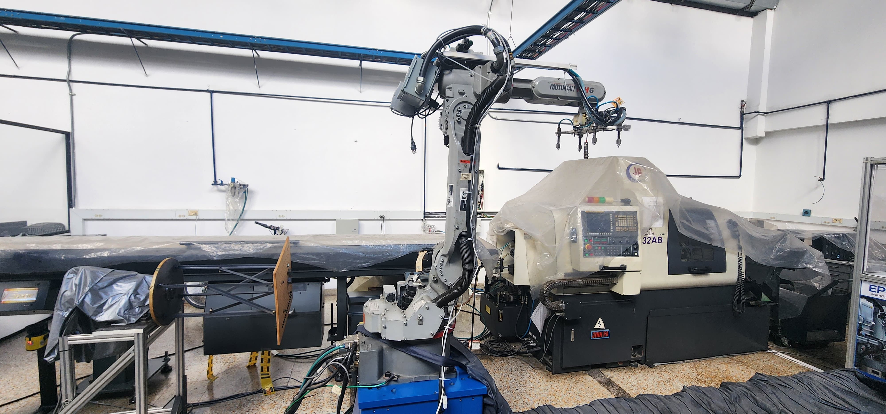
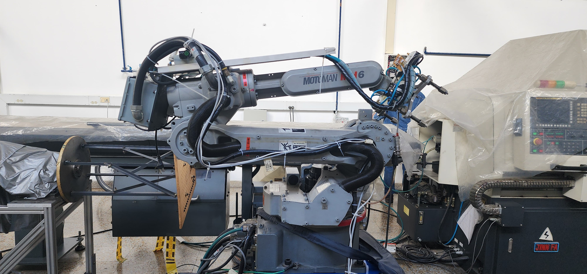

# Laboratorio RoboDK

  

## Introducción del laboratorio
---

Los objetivos del presente laboratorio son varios:
  1. Comprensión del manipulador Motoman MH6 y su software de manejo (en este caso, RoboDK) por medio de su comparación con el IRB-140 y Robotstudio, además de la indagación individual de este manipulador.
  2. Aprender a manejar el manipulador desde código, en particular Python.
  3. Programar una trayectoria en RoboDK, ejecutarla virtualmente (simulación) y realizarla físicamente comandado desde PC.

## Parte No.1: Comparación de las especificaciones técnicas del Motoman MH6 y el IRB140.
---

### Generalidades a comparar
Haciendo uso de los archivos suministrados de manual de especificaciones y de producto del IRB-140, en conjunto con el material suministrado del manual de referencia del MH6, se realizó el siguiente cuadro comparativo:

| Característica                   | **Motoman MH6**                                               | **ABB IRB 140**                                                  |
|----------------------------------|---------------------------------------------------------------|------------------------------------------------------------------|
| **Carga máxima (payload)**       | 6 kg                                                          | 6 kg                                                             |
| **Alcance máximo (reach)**       | 1373 mm                                                       | 810 mm                                                           |
| **Grados de libertad (ejes)**    | 6                                                             | 6                                                                |
| **Repetibilidad**                | ±0.08 mm                                                      | ±0.03 mm                                                         |
| **Velocidad máx. conjunta**      | Hasta 18700 mm/s (sumatoria de ejes)                          | Hasta 6.5 m/s dependiendo de configuración y carga |
| **Velocidades por eje**          | Varían entre 145 y 375 °/s dependiendo del eje                | Hasta 460 °/s en algunos ejes |
| **Rango de movimiento por eje**  | -180° a +180° en la mayoría de ejes                           | Ejes con rangos entre ±120° y ±300° dependiendo del eje         |
| **Montaje**                      | Piso, techo, pared                                            | Piso, pared, techo, invertido (multiorientación)                |
| **Peso del robot**               | Aprox. 130 kg                                                 | 140 kg           |
| **Aplicaciones típicas**         | Manipulación de materiales, soldadura, ensamblaje             | Ensamblaje, soldadura, manejo de materiales, fundición (Foundry Plus) |
| **Protección ambiental**         | IP54 (opcional IP65 con protección extra)                     | IP67 (Foundry Plus 2, ideal para fundición) |
| **Controlador**                  | NX100 o DX100 (dependiendo del año)                           | IRC5 con RobotWare                                              |
| **Interfaz de programación**     | Teach Pendant con lenguaje INFORM II                          | FlexPendant con lenguaje RAPID                                  |
| **Precisión absoluta (calibración)** | No especificado                                           | Opcional con Absolute Accuracy |

Como se puede observar, el IRB 140 destaca mucho más por su mayor precisión (±0.03 mm frente a ±0.08 mm del MH6) y su diseño compacto, lo cual lo puede hacer ideal para espacios reducidos o tareas de ensamblaje de alta precisión. Tiene más protección lo que lo hace más adecuado para ambientes agresivos como fundiciones o procesos húmedos, quedando relegado el MH6 para tareas de ensamblaje sencillas. El Motoman MH6 ofrece un mayor alcance (1373 mm vs. 810 mm), lo cual lo favorece para operaciones de paletizado, carga/descarga o trabajos donde se necesita cubrir más área sin mover la base, y su peso más ligero también facilita la integración en células móviles. Por ende es difícil indicar la superioridad de uno o de otro: si se prioriza precisión y resistencia ambiental, el IRB 140 es superior, pero si se necesita cobertura espacial amplia y flexibilidad de montaje, el MH6 puede resultar el más conveniente.

### Homes
El Motoman MH6 permite ajustar su posición "home" o de referencia con hasta dos posiciones de home configurables: **Home 1** y **Home 2**. Según nuestra indagación, esto puede ser útil dado que en aplicaciones con diferentes secuencias o configuraciones de trabajo, puede ser útil definir más de un punto de referencia inicial para facilitar tareas específicas o evitar colisiones al encender el robot en distintos contextos operativos. Estas posiciones se configuran desde el Teach Pendant y pueden ser modificadas mediante el menú de programación o ajustes del sistema, típicamente bajo funciones de referencia de posición o coordenadas base. 
El ABB IRB 140 solamente tiene una única posición de referencia, que corresponde al sistema de coordenadas base y la calibración absoluta almacenada. Esta posición "home" es establecida en el proceso de calibración y sincronización con el sistema IRC5. La precisión del IRB 140 depende de mantener esa posición constante; no está pensado para cambiarse frecuentemente ni tener múltiples homes, lo cual está alineado con su enfoque en precisión y repetibilidad.

  

  

## Parte No.1: Comparación de las especificaciones técnicas del Motoman MH6 y el IRB140.
---

### Preliminares
---

Se dispone de las siguientes herramientas en el laboratorio:
  - Un manipulador industrial IRB-140 de la marca ABB.

  

  - Un controlador IRC5 con un módulo de distribución de energía 3HAC025917-001/00 DSQC 652.
  - Un RobotTeach Pendent de ABB modelo 3HACO28357—001 para el controlador IRC5.

  

