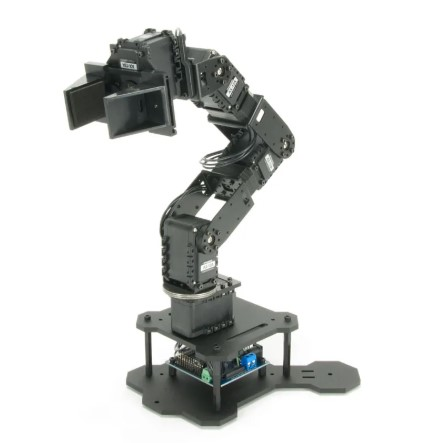
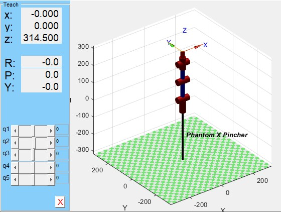
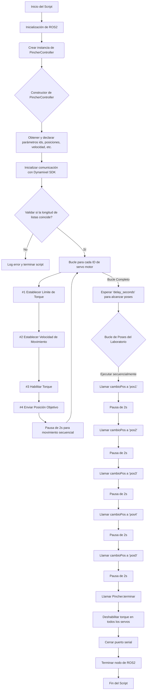

# Laboratorio No.4 (_Phantom X Pincher_)

<p align="center">
  
</p>

## Introducción del laboratorio


Los objetivos del presente laboratorio son varios:
  1. Hacer uso de ROS para manipular los servomotores del robot _Phantom X Pincher_, haciendo uso de la referencia en particular de estos servos (Dynamixel AX-12).
  2. Aprender a manejar y manipular los estados y comandos para los controladores de articulaciones de este robot.
  3. Comprender los servicios de operación del robot para sus articulaciones.
  4. Haciendo uso del framework de ROS, usar Python para conectar con las articulaciones y manipularlas.

---

## Parte No.1: Mediciones y Análisis del Phantom X Pincher.

El robot _Phantom X Pincher_ es un robot pequeño con una gripper de prensa en su extremo. Cuenta con seis grados de libertad, todas son rotacionales; sin embargo, la sexta articulación funciona exclusivamente para el gripper, funguiendo con un mecanismo sencillo para transformar movimiento rotacional en lineal (cierre y apertura de la garra), de forma que no incide ni en la orientación del gripper ni en la posición del TCP, o siquiera cambia la configuración del robot. Así pues, se puede analizar su cinemática directa con cinco articulaciones únicamente:

<p align="center">
  
</p>

Del cual se obtiene la siguiente tabla de parámetros Denavit-Hartenberg.

| i | $\theta_i$ (rad) | $d_i$ (mm) | $a_i$ (mm) | $\alpha_i$ (rad) | **Offset** (rad) |
|---|---|---|---|---|---|
| **1** | $\theta_1$ | 42 | 0 | $\pi/2$ | $\pi/2$ |
| **2** | $\theta_2$ | 0 | 104.5 | 0 | $\pi/2$ |
| **3** | $\theta_3$ | 0 | 103 | 0 | 0 |
| **4** | $\theta_4$ | 0 | 0 | $\pi/2$ | $\pi/2$ |
| **5** | $\theta_5$ | 65 | 0 | 0 | $\pi/2$ |

Sin embargo, obsérvese que estas medidas son solo las más cercanas entre articulaciones (es decir, las distancias normales a los ejes de las articulaciones). Son relevantes también las dimensiones físicas de algunos de sus componentes, pues determinarán muchas de las limitaciones espaciales o capacidades de movimiento del mismo, inclueyendo aplicaciones. Se obtuvieron las siguientes haciendo uso de un pie de rey:

| **Eslabón (físico)** | **Medidas (mm)** |
|---|---|
| 1era a 2da (extremos) | 103.03 |
| 2da a 3ra (extremos) | 103.35 |
| 3era base a 3era extremo | 73.67 |
| 3era extremo hasta el TCP | 108.74 |

Observe que no necesariamente coinciden con las medidas que se dieron en la tabla DH, puesto que este busca una simplificación cinemática que dadas las articulaciones y su relación espacial dé el mismo efecto del TCP que el manipulador real. Ahora bien, si se grafican con MATLAB únicamente la tabla de DH se puede ver el siguiente modelo:

<p align="center">
  
</p>


## Parte No.2: Manejo del _Phantom X Pincher_ con ROS2.

---

Antes de proceder con su manejo particular, se debe ser un poco más exacto con el vocabulario aquí y referirse al _Phantom_ en tanto manipulador y no como un robot, a pesar de que esta última acepción es válida también. La necesidad nace del hecho del controlador en particular. Si bien el hardware de control siempre es el mismo (en terminos de control y HMI), es decir el computador, el software de manejo puede variar. Según la documentación oficial hay diversas maneras de manejo tanto con software dedicado de Dynamixel como ROS2, y ROS2 en tanto _framework_ abre la posibilidad de programación tanto de rutinas, del "controlador" y de una HMI virtual para su manejo. 

Así pues, destáquese que aquí se ha procedido con el uso de Python y ROS2 en tanto framework para manejar el manipulador, de la siguiente manera:
  1. Un script de manejo de los servos en particular, para el posicionamiento y diseño de rutinas del manipulador.
  2. Un script que crea una interfaz de manejo virtual haciendo uso de la librería _Tkinter_, que vincula al anterior código.
  3. Un script que utiliza los tópicos y servicios de ROS, basándose en la estructura del Dynamixel Workbench, para controlar las articulaciones del manipulador.
  4. Dos scripts de conexión: uno que permite la publicación y otro de suscripción en cada tópico de controlador por articulación.

Destaca que algunos de estos scripts se podrían integrar entre sí. De hecho, comparten muchas elementos y ocasionalmente estructuras. El motivo de esta segmentación es para mejor organización y distinción funcional, para llevar a cabo de manera secuencial los objetivos del laboratorio.

### Primer Script: Rutinas y posicionamientos particulares (`control_servo.py`).

Este es el script de manejo general y para controlar el robot manipulador. A continuación se describen las partes relevantes del mismo. Más exactamente, es un nodo de ROS2 que se encarga de la cinemática directa del manipulador _Phantom X Pincher_, manejando las articulaciones del brazo robótico mediante comandos de posición enviados a los servomotores _Dynamixel AX-12A_. El código establece la comunicación, configura los parámetros de los motores, y envía posiciones angulares objetivo a cada uno de ellos.

```python
import rclpy
from rclpy.node import Node
from dynamixel_sdk import PortHandler, PacketHandler
import time
```

Inicialmete se instanción las bibliotecas `rclpy` para la comunicación con ROS2/creación del nodo y `dynamixel_sdk` para interactuar directamente con los servomotores Dynamixel AX-12A que componen las articulaciones del robot. `PacketHandler` y `PortHandler` son clases de esa segunda biblioteca para manejar la comunicación serial y la creación de paquetes de datos para los servomotores Dynamixel.

```python
ADDR_TORQUE_ENABLE    = 24
ADDR_GOAL_POSITION    = 30
ADDR_MOVING_SPEED     = 32
ADDR_TORQUE_LIMIT     = 34
ADDR_PRESENT_POSITION = 36
```

Acto seguido se declaran las direcciones de registro, con diferentes finalidades del código. En orden: para habilitar o deshabilitar el torque del motor, para escribir la posición angular objetivo, para controlar la velocidad del movimiento, para establecer el límite máximo de torque y para leer la posición angular actual del motor.

Inmediatamente después se da el código del nodo: se declara la clase `PincherController`y se definen sus elementos (no se muestran aquí por extensión, pero se describen sus funciones). En esta se inicializa el nodo, se declaran los parámetros configurables (`port`, `baudrate`, `dxl_ids`, `goal_positions`, `moving_speed`, `torque_limit` y `delay`); de entre ellos es fácil deducir su función, a excepción de `dxl_ids`. Este último es una lista de los IDs de los servomotores del robot (ej. [1, 2, 3, 4, 5]). Después de hacer el manejo de la comunicación, la validación, se pasa al siguiente bloque:

```python
# 1) Configurar torque_limit, velocidad y enviar posición a cada servo
for dxl_id, goal in zip(dxl_ids, goal_positions):
    # Limitar torque
    packet.write2ByteTxRx(port, dxl_id, ADDR_TORQUE_LIMIT, torque_limit)
    # Limitar velocidad
    packet.write2ByteTxRx(port, dxl_id, ADDR_MOVING_SPEED, moving_speed)
    # Habilitar torque
    packet.write1ByteTxRx(port, dxl_id, ADDR_TORQUE_ENABLE, 1)
    # Enviar posición objetivo
    packet.write2ByteTxRx(port, dxl_id, ADDR_GOAL_POSITION, goal)
    self.get_logger().info(f'[ID {dxl_id}] → goal={goal}, speed={moving_speed}, torque_limit={torque_limit}')
    time.sleep(2)

# 2) (Opcional) Leer y mostrar posición actual
for dxl_id in dxl_ids:
    pos, _, _ = packet.read2ByteTxRx(port, dxl_id, ADDR_PRESENT_POSITION)
    self.get_logger().info(f'[ID {dxl_id}] posición actual={pos}')

# 3) Esperar a que todos los servos alcancen la posición
self.get_logger().info(f'Esperando {delay_seconds}s para completar movimiento...')
time.sleep(delay_seconds)

# 4) Apagar torque en todos los servos
def terminar(self):
for dxl_id in self.dxl_ids:
    self.packet.write1ByteTxRx(self.port, dxl_id, ADDR_TORQUE_ENABLE, 0)

# 5) Cerrar puerto y terminar nodo
self.port.closePort()
rclpy.shutdown()
```

Este bloque de dos bucles y uno de espera tienen como objetivo iterar sobre cada motor para realizar la siguiente secuencia de acciones, con el fin de llevar paso a paso el movimiento del manipulador:
  1. Configura el `torque_limit` y el `moving_speed` de cada motor.
  2. Habilita el torque (`TORQUE_ENABLE`) en cada servomotor.
  3. Envía la posición objetivo (`GOAL_POSITION`) a cada motor para iniciar el movimiento.
  4. Lee la posición actual del motor y la imprime en el log del nodo.
  5. Se introduce una pausa, esperando que todas las posiciones se hayan enviado con el fin de permitir que todos los motores alcanzen su posición final.
  6. Se deshabilita el torque en todos los servos.
  7. Se cierra el puerto y se apaga el nodo.
       
Este bloque de instrucciones se complementa, luego, con los siguientes para poder generar una rutina:

```python
    def cambioPos(self, newPos):
        if len(newPos) != len(self.dxl_ids):
            self.get_logger().error("La nueva posición debe tener la misma longitud que dxl_ids")
            return

        self.goal_positions = newPos

        for dxl_id, goal in zip(self.dxl_ids, self.goal_positions):
            self.packet.write2ByteTxRx(self.port, dxl_id, ADDR_GOAL_POSITION, goal)
            self.get_logger().info(
                f'[ID {dxl_id}] → goal={goal}, speed={self.moving_speed}, torque_limit={self.torque_limit}'
            )
            time.sleep(2)
```

Este método permite cambiar la posición del robot a una nueva configuración. Valida la longitud de la nueva lista de posiciones, itera sobre cada motor y envía la nueva posición objetivo (`GOAL_POSITION`). Luego de esto vienen las funciones principales donde se puede programar la plantilla de la rutina como tal, jugando con listas de posiciones y llamado de métodos. Aquí un ejemplo de una en particular: 

```python
def main(args=None):
    rclpy.init(args=args)
    Pincher = PincherController()
    pos0 = [512, 512, 512, 512, 512] 
    pos1 = [582, 582, 568, 454, 512]
    pos2 = [412, 610, 426, 596, 512]
    pos3 = [753, 454, 667, 582, 512]
    pos4 = [738, 412, 667, 383, 512]

    '''time.sleep(2)
    Pincher.cambioPos(pos1)
    time.sleep(2)
    Pincher.cambioPos(pos2)
    time.sleep(2)
    Pincher.cambioPos(pos3)
    time.sleep(2)
    Pincher.cambioPos(pos4)
    time.sleep(2)
    Pincher.cambioPos(pos0)
    Pincher.terminar()
    #while True:'''

if __name__ == '__main__':
    main()
```

Ahora, un diagrama de flujo de todas estas acciones de este script:



Es necesario mencionar que esta rutina ejemplo en particular será la empleada para llevar a cabo la tarea del laboratorio que solicita que se probaran las poses generadas por:
  - $0$, $0$, $0$, $0$, $0$.
  - $25$, $25$, $20$, $-20$, $0$.
  - $-35$, $35$, $-30$, $30$, $0$.
  - $85$, $-20$, $55$, $25$, $0$.
  - $80$, $-35$, $55$, $-45$, $0$.

Esto se mostrará en el video del final.


### Segundo Script: HMI (`pincher_gui.py`).

---


## Parte No.3: RoboDK

### Generalidades
RoboDK es una plataforma de simulación y programación offline para robots industriales. Permite crear, simular y validar trayectorias robóticas sin necesidad de tener el robot físicamente conectado. Es compatible con más de 500 modelos de robots de fabricantes como ABB, KUKA, FANUC, Yaskawa Motoman, UR, entre otros. Como software libre, es muy abierto y útil, y su amplia compatibilidad lo hace muy versátil.

Se enuncian muy rápidamente un par de aplicaciones comunes del software: 
  - Programación offline paradesarrollar y probar programas sin interrumpir la producción.
  - Simulación de trayectorias para verificar alcance, colisiones, singularidades o movimientos inviables de códigos predefinidos.
  - Mecanizado robótico, en la medida en que puede generar códigos para operaciones de fresado, corte láser, plasma, etc.
  - Paletizado y Pick & Place (diseñar layouts y flujos de trabajo automatizados).
  - Control y comunicación en tiempo real, enviando comandos al robot conectado.

Obsérvese que la primera y última aplicación van a ser las del caso de este laboratorio.

### Comunicación con el manipulador
Este proceso se puede resumir de la siguiente forma:
  1. Tan pronto se termine la trayectoria y movimientos, o se tenga el código de Python, ambos interpretables para el usuario, RoboDK procede a generar un programa nativo para el robot en cuestión con el que se esté trabajando (por ejemplo, INFORM para Yaskawa, RAPID para ABB).
  2. Al estar conectado a computadora el robot, se configura la conexión y se transfiere via USB, red o memoria el programa al controlador.
  3. Para control en tiempo real (más allá del cargado del programa), RoboDK puede conectarse directamente con el robot usando un driver de comunicación (como el RoboDK Driver for Motoman DX100). En este modo se envíab posiciones y velocidades desde el PC.

Teóricamente, lo que realmente está haciendo RoboDK para mover el robot son cálculos de trayectorias por medio de cinemática inversa. A partir de esos resultados y los parámetros de movimiento, como velocidad y tipo, genera instrucciones específicas para el controlador (como MOVJ, MOVL, WAIT, etc.). Si está ejectuando en tiempo real, inicia sesión con el controlador vía Ethernet/IP o protocolo propietario y envía comandos de coordenadas XYZ y orientaciones RPY a una velocidad determinada, y el controlador ejecuta esos comandos en el orden y tiempo dado.

### Comparación RoboDK con RobotStudio

<p align="center">
  
</p>

Se presenta en seguida un cuadro comparativo de ambos softwares:

| Característica / Funcionalidad     | **RoboDK**                                                        | **RobotStudio (ABB)**                                           |
|-----------------------------------|-------------------------------------------------------------------|------------------------------------------------------------------|
| **Fabricantes compatibles**       | Multimarca (ABB, FANUC, KUKA, Yaskawa, UR, etc.)                  | Exclusivo para robots ABB                                        |
| **Lenguaje de programación**      | Genera código nativo según marca (INFORM, RAPID, KRL, etc.)       | RAPID (ABB)                                                      |
| **Simulación 3D**                 | Sí, precisa y multiplataforma                                     | Sí, altamente realista, con cinemática exacta de ABB             |
| **Programación offline**          | Sí, con postprocesadores configurables                            | Sí, con integración total con hardware y software ABB            |
| **API para control externo**      | Python, C++, C#, MATLAB                                           | No API directa para control externo, pero sí para automatización interna en RAPID |
| **Control en tiempo real**        | Sí, mediante drivers específicos (conectividad Ethernet/USB)      | Limitado, más orientado a emulación y sincronización virtual     |
| **Interfaz de usuario**           | Intuitiva, con soporte para arrastrar y soltar, GUI adaptable     | Más técnica, con entornos integrados como RobotWare              |
| **Importación CAD/CAM**           | Sí (STEP, IGES, STL, DXF, G-code para mecanizado)                 | Sí, pero más orientado a integración con soluciones ABB           |
| **Postprocesamiento**             | Flexible, personalizable, permite modificar postprocesadores      | Fijo (RAPID), aunque admite plantillas RAPID avanzadas            |
| **Ideal para...**                 | Universidades, empresas multimarcas, mecanizado robótico          | Empresas con integración ABB completa, automatización industrial |
| **Licencia y costo**              | Pago único por módulo o licencia perpetua, más asequible          | Costo más alto, licencia anual, acceso limitado por funciones    |
| **Documentación y comunidad**     | Amplia, foros activos, tutoriales en video y ejemplos reales      | Muy documentado, pero limitado a comunidad ABB                   |
| **Limitaciones principales**      | No permite simulación avanzada de controladores específicos (ej. ciclo scan interno del robot) | Solo sirve para ABB, no exporta a otros lenguajes ni marcas      |
| **Mecanizado robótico**           | Avanzado: genera trayectorias de fresado, corte, impresión 3D     | Muy limitado, no diseñado para CAM robótico                      |
| **Realismo de simulación**        | Bueno, con motores cinemáticos configurables                      | Excelente: 100% fiel al comportamiento real del robot ABB        |
| **Compatibilidad con PLC/sensores**| Parcial (requiere scripting avanzado o drivers personalizados)    | Alta, cuando se usa con Virtual Controller o PLC ABB             |

Las comparaciones anteriores son diversas y puntuales cada una, pero hay unas que consideramos destaca sobre todas las demás: 
  - Creación y ajuste trayectorias.
  - Herramientas de simulación.
  - Complejidad de la interfaz de usuario.

La generación de trayectorias con RoboDK es muy sencilla tómese el camino que se tome, ya que se crean los sistemas coordenados y los puntos son universales. Eventualmente el mismo programa los asocia uno relativo a otro y se pueden organizar de esta forma en un arbol. Los tipos de movimientos a definir son equivalentes con RobotStudio (lineal, MoveJ y curvo). Incluso la progrmación en Python, que es más exacta, es viable y mucho más precisa, permitiendo usar uan gran cantidad de puntos. RobotStudio tiene varios de estos elementos equivalentes, como targets en vez de puntos, y hace uso de paths, y es más minucioso sobre la definición de los elementos. La definición de targets no es tan libre ya que hay más opciones, pero al tener más parámetros es más organizada, rigurosa y exacta, de forma que se debe tener cuidado y entender bien lo que se hace. Se debe, luego, configurar con RAPID las trayectorias y ajustarlas bien en base a targets, y se debe seguir un procedimiento bastante rígido para llevar a cabo un módulo, aunque tampoco es necesariamente complicado. Se encuentra una desventaja en RobotStudio dadas las posibilidades que ofrece la programación de módulos con Python.

Las herramientas de simulación son mucho más amplias, ricas y completas en RobotStudio, por lo que se puede considerar una ventaja. Es bastante rígido también su uso, pero ventajoso a la larga, y los elementos de entorno como workobjects también se pueden ajustar con más detalle. De nuevo, RoboDK es simple, pero sencillo.

La complejidad de la interfaz de usuario y la relación entre las diferentes partes del software en RobotStudio es lo que más lo puede hacer destacar. RoboDK, sin embargo, presenta condensado y directo el conjunto de herramientas básicas y opciones de uso común, y rápido, en la interfaz, sin mucho detalle o profundidad.

---


## Parte No.4: Práctica

### Código

El objetivo de la parte práctica fue, por medio de RoboDK, realizar un script de Python que pudiese generar una trayectoria polar y probarla en simulación. Luego, subirla al MH6 y verificar su funcionamiento apropiado. Se comienza primero con la descripción, a grandes rasgos, funcional del código.

En primer lugar el encabezado:

```Python
from robodk.robolink import *
from robodk.robomath import *
import math
```

Estas librerías tienen las siguientes funcionalidades: la primera es una API que permite traducir las funciones de movimiento de Python en comandos que estén en el lenguaje de RoboDK. Claramente, luego estas se traducen una segunda vez para el controlador del robot en particular. La segunda librería es de funciones matemáticas propiamente para usar con funciones de la librería de RoboDK. Luego se tiene la inicialización:

```Python
RDK = Robolink()
robot = RDK.ItemUserPick("Selecciona un robot", ITEM_TYPE_ROBOT)
if not robot.Valid():
    raise Exception("No se ha seleccionado un robot válido.")
if not robot.Connect():
    raise Exception("No se pudo conectar al robot. Verifica que esté en modo remoto y que la configuración sea correcta.")
if not robot.ConnectedState():
    raise Exception("El robot no está conectado correctamente. Revisa la conexión.")
print("Robot conectado correctamente.")
```

La primera línea crea un objeto de la clase Robolink, y la segunda permite seleccionar un robot en el caso de que se programe para más de uno. Las siguientes líneas son de verificación si la selección es válida y si la conexión está bien. _Estas son líneas que funcionarán si y solo sí se ejecuta con el controlador real, de forma que estas líneas de confirmación se deben comentar a la hora de ejecutar la simulación._

```Python
frame_name = "Frame_from_Target1"
frame = RDK.Item(frame_name, ITEM_TYPE_FRAME)
if not frame.Valid():
    raise Exception(f'No se encontró el Frame "{frame_name}" en la estación.')

robot.setPoseFrame(frame)
robot.setPoseTool(robot.PoseTool())

robot.setSpeed(300)
robot.setRounding(5)
```

Este siguiente bloque de instrucciones tiene como fin definir y cargar el frame, que es el workobject sobre el cual se van a realizar la trayectorias. Dado que el frame está inclinado y posicionado, es necesario cargarlo y dada la información cargada se ajustará. En particular, estas líneas asignan el frame al robot en particular que estemos empleando, luego se indica el usao de la herramienta activa y finalmente se dan dos líneas que son parámetros **únicos** de velocidad y blending para el robot (es decir, tendran efecto a lo largo de toda la operación hasta el final de su trabajo).

```Python
num_points = 720      
A = 30
z_surface = 0
z_safe = 50
```

Este siguiente bloque es de definición de parámetros que serán, básicamente, valores constantes a lo largo de la operación y útiles para realizarla. 
  - El parámetro _num_points_ es el número de puntos o targets que tendrá en cuenta el robot: como tal, por medio de funciones lo que se hace es mover el robot de un target a otro, y por medio de código se puede hacer de forma que por medio de movimientos de tipo lineal o J se mueva a distancias cortas más o menos discretas pero tantas que cree una trayectoria suave.
  - El parámetro _A_ es solo un factor de escala: en relación a la zona a dibujar hay una proporción dimensional que se está manejando de distancia física. Dado que, inicialmente, es muy pequeña, se multiplica este parámetro por cualquier movimiento para hacer que sea más grande la figura, los movimientos más largos, etc.
  - El parámetro *z_surface* tiene como fin definir un nivel de altura con respecto al plano de dibujo, por si se quiere mantener un offset de _approach_ o dibujar sobre el aire. Debido a que se quiere dibujar sobre el plano, es igual a 0.
  - Finalmente, *z_safe* es un parámetro de altura segura para aproximación y salida de la herramienta.

```Python
robot.MoveJ(transl(0, 0, z_surface + z_safe))
robot.MoveL(transl(0, 0, z_surface))
```

Aquí comienza el dibujado. La primera línea nos sitúa en el centro de la figura a realizar, y la segunda nos acerca a la superficie.

```Python
full_turn = 2*math.pi

for i in range(num_points+1):
    t = i / num_points
    theta = full_turn * t

    r = A*(2 - 2*math.sin(theta) + (math.sin(theta)*math.sqrt(math.fabs(math.cos(theta))))/(math.sin(theta)+1.4))

    x = r * math.cos(theta)
    y = r * math.sin(theta)
 
    robot.MoveL(transl(x, y, z_surface))
```

Este bloque ya describe el dibujado completo: 
  - Se define una variable que va a indicar que, dado que es una trayectoria polar, va a girar, iniciando desde 0° hasta 360°.
  - Ahora bien, se inserta un ciclo que define el punto a moverse con respecto a uno anterior para moverse linealmente hacia él.
  - Dado que estamos manejando funciones polares, necesitamos un radio y un ángulo. Con ayuda del total del giro (que son 360°), se divide sobre el total de número de puntos de forma que se tenga el valor del ángulo para cada uno de todos los 720 puntos. Acto seguido, con al relación de variable dependiente (radio) a partir de la dependiente (ángulo) se obtiene la primera, y esta relación describe la figura, que es un corazón.
  - Cada vez que se obtiene un radio, se usa en cojunto con el theta y se parametrizan a coordenadas cartesianas, puesto que la librería solo maneja coordenadas cartesianas. Se emplean, pues, fórmulas de libro.

Una vez el ciclo termina, se sube la herramienta para evitar choques:

```Python
robot.MoveL(transl(x, y, z_surface + z_safe))
```
Y finaliza el módulo.

En el siguiente video se muestran estos resultados: [Link al video de la presentación en youtube.](https://youtu.be/XjKmvOQerTY)

