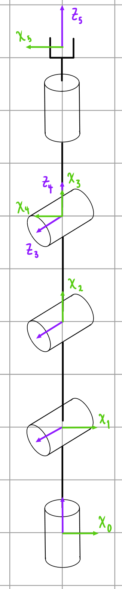

# Laboratorio No.4 (_Phantom X Pincher_)

<p align="center">
  
</p>

## Introducción del laboratorio


Los objetivos del presente laboratorio son varios:
  1. Hacer uso de ROS para manipular los servomotores del robot _Phantom X Pincher_, haciendo uso de la referencia en particular de estos servos (Dynamixel AX-12).
  2. Aprender a manejar y manipular los estados y comandos para los controladores de articulaciones de este robot.
  3. Comprender los servicios de operación del robot para sus articulaciones.
  4. Haciendo uso del framework de ROS, usar Python para conectar con las articulaciones y manipularlas.

---

## Parte No.1: Mediciones y Análisis del Phantom X Pincher.

El robot _Phantom X Pincher_ es un robot pequeño con una gripper de prensa en su extremo. Cuenta con seis grados de libertad, todas son rotacionales; sin embargo, la sexta articulación funciona exclusivamente para el gripper, funguiendo con un mecanismo sencillo para transformar movimiento rotacional en lineal (cierre y apertura de la garra), de forma que no incide ni en la orientación del gripper ni en la posición del TCP, o siquiera cambia la configuración del robot. Así pues, se puede analizar su cinemática directa con cinco articulaciones únicamente:

<p align="center">
  
</p>

Del cual se obtiene la siguiente tabla de parámetros Denavit-Hartenberg.

| i | $\theta_i$ | **d_i** | **a_i** | $\alpha_i$ | **Offset** |
|---|---|---|---|---|---|
| **1** | $\theta_1$ | 42 | 0 | $\pi/2$ | $\pi/2$ |
| **2** | $\theta_2$ | 0 | 104.5 | 0 | $\pi/2$ |
| **3** | $\theta_3$ | 0 | 103 | 0 | 0 |
| **4** | $\theta_4$ | 0 | 0 | $\pi/2$ | $\pi/2$ |
| **5** | $\theta_5$ | 65 | 0 | 0 | $\pi/2$ |


<p align="center">
  
</p>

Como se puede observar, el IRB 140 destaca mucho más por su mayor precisión (±0.03 mm frente a ±0.08 mm del MH6) y su diseño compacto, lo cual lo puede hacer ideal para espacios reducidos o tareas de ensamblaje de alta precisión. Tiene más protección lo que lo hace más adecuado para ambientes agresivos como fundiciones o procesos húmedos, quedando relegado el MH6 para tareas de ensamblaje sencillas. El Motoman MH6 ofrece un mayor alcance (1373 mm vs. 810 mm), lo cual lo favorece para operaciones de paletizado, carga/descarga o trabajos donde se necesita cubrir más área sin mover la base, y su peso más ligero también facilita la integración en células móviles. Por ende es difícil indicar la superioridad de uno o de otro: si se prioriza precisión y resistencia ambiental, el IRB 140 es superior, pero si se necesita cobertura espacial amplia y flexibilidad de montaje, el MH6 puede resultar el más conveniente.

### Homes
El Motoman MH6 permite ajustar su posición "home" o de referencia con hasta dos posiciones de home configurables: **Home 1** y **Home 2**. Según nuestra indagación, esto puede ser útil dado que en aplicaciones con diferentes secuencias o configuraciones de trabajo, puede ser útil definir más de un punto de referencia inicial para facilitar tareas específicas o evitar colisiones al encender el robot en distintos contextos operativos. Estas posiciones se configuran desde el Teach Pendant y pueden ser modificadas mediante el menú de programación o ajustes del sistema, típicamente bajo funciones de referencia de posición o coordenadas base. 
El ABB IRB 140 solamente tiene una única posición de referencia, que corresponde al sistema de coordenadas base y la calibración absoluta almacenada. Esta posición "home" es establecida en el proceso de calibración y sincronización con el sistema IRC5. La precisión del IRB 140 depende de mantener esa posición constante; no está pensado para cambiarse frecuentemente ni tener múltiples homes, lo cual está alineado con su enfoque en precisión y repetibilidad.

Ya en la operación física de estos elementos, se identifican dos homes predefinidos que fueron configurados en laboratorio. El primero es el siguiente

<p align="center">
  
</p>

Y en segundo:

<p align="center">
  
</p>

Si bien no se recibió indicación clara de aquellos que lo ajustaron, se pueden hacer las siguientes suposiciones educadas de por qué pudieron haber sido configuradas de tal forma. Se tiene en cuenta, además, que este es un manipulador de laboratorio, por lo que no tiene sentido tener varios homes para diferentes procesos. Por un lado, el robot tiene una elevación respecto al suelo de su base, y su posición más alta puede servir de home para el inicio de procesos de movimiento de cualquier tipo. El otro, por su parte, puede ser para cambios de herramienta dada su cercanía con el suelo. Nótese que en una posición tan alta como la del primer home se vuelve terriblemente incómodo cambiar de herramienta, y para una posición tan baja como la del segundo es bastante posible una colisión con cualquier objeto de trabajo a incluso moverse a una posición inicial de movimiento de la trayectoria principal.

---


## Parte No.2: Manejo del Motoman MH6.

### Movimiento

Hay varias formas de operar este manipulador:
  - Movimiento manual articular.
  - Movimiento manual cartesiano (rotación y traslación).
  - Movimiento automático de varios tipos.

Se describe a continuación el procedimiento, en el Teach Pendant DX100, respectivo para lograr la operación manual articular y cartesiana.

<p align="center">
  
</p>

En ambos casos, primero es necesario asegurarse de que el botón de emergencia no esté bloqueado y el manipulador se encuentre en una posición segura (preferiblemente un home). Acto seguido, se activa el modo manual girando el **selector de modo** (el cerrojo con llave, que es un switch físico) en la esquina superior izquierda hasta ubicarlo en la posición **MANUAL**. Se asegura uno que los motores de las articulaciones estén encedidos, y si no se presiona el botón **SERVO ON READY** en el centro. Luego, se procede con cada caso respectivo.

<p align="center">
  
</p>

#### Movimiento articular
Para este caso:
  1. Se presiona el botón **COORD** hasta que en la pantalla aparezca el modo "Joint" o "EJE".
  2. Se usan las teclas de dirección +/- en el grupo de cursores (los 6 pares de teclas: "S", "L", "U", "R", "B", "T"). Se encuentran en el centro del Teach en el lado derecho e izquierdo (para ejes básicos y de muñeca).
  3. Uno puede ajustar la velocidad con las teclas de en medio y se debe poder observar el cambio en la pantalla. Además, se debe mantener presionado el botón de hombre muerto cuando se presionen las teclas de dirección.

#### Movimiento cartesiano
Para este caso
  1. Se presiona el botón **COORD** hasta que en la pantalla aparezca el modo "RECT".
  2. Se usan las mismas teclas de dirección, pero ahora uno se guía por los otras letras imprentas: ±X, ±Y o ±Z indican los ejes y puede tener un simbolo de giro en tanto flecha curva o no. Si lo tiene, corresponde a los botones de rotación, y si no de traslación. Estos se agrupan según este criterio a la derecha e izquierda (derecha rotación e izquierda traslación).
  3. Mismo criterio de velocidad y presionar el botón de hombre muerto.

<p align="center">
  
</p>

### Cambio de velocidad
El MH6 tiene cinco niveles de velocidad predefinidos para el modo manual: 5%, 15%, 25%, 50% y 100%. Sin embargo, se puede cambiar el nivel de velocidad de la siguiente forma:
  1. Se selecciona el modo **TEACH**.
  2. Se activan los servos con **SERVO ON READY**.
  3. Presiona la tecla [SELECT].
  4. En el menú se selecciona la opción "Velocidad manual" o similar (puede estar en inglés como "Manual Speed").
  5. Se usan las teclas de flecha para navegar y seleccionar el nivel deseado (ej. 25%). Luego se coloca **ENTER**.

Se debe recalcar que en la parte superior derecha de la pantalla, se muestra un campo que indica la velocidad activa, con un valor numérico seguido del símbolo % (por ejemplo, "Vel: 50%").

---


## Parte No.3: RoboDK

### Generalidades
RoboDK es una plataforma de simulación y programación offline para robots industriales. Permite crear, simular y validar trayectorias robóticas sin necesidad de tener el robot físicamente conectado. Es compatible con más de 500 modelos de robots de fabricantes como ABB, KUKA, FANUC, Yaskawa Motoman, UR, entre otros. Como software libre, es muy abierto y útil, y su amplia compatibilidad lo hace muy versátil.

Se enuncian muy rápidamente un par de aplicaciones comunes del software: 
  - Programación offline paradesarrollar y probar programas sin interrumpir la producción.
  - Simulación de trayectorias para verificar alcance, colisiones, singularidades o movimientos inviables de códigos predefinidos.
  - Mecanizado robótico, en la medida en que puede generar códigos para operaciones de fresado, corte láser, plasma, etc.
  - Paletizado y Pick & Place (diseñar layouts y flujos de trabajo automatizados).
  - Control y comunicación en tiempo real, enviando comandos al robot conectado.

Obsérvese que la primera y última aplicación van a ser las del caso de este laboratorio.

### Comunicación con el manipulador
Este proceso se puede resumir de la siguiente forma:
  1. Tan pronto se termine la trayectoria y movimientos, o se tenga el código de Python, ambos interpretables para el usuario, RoboDK procede a generar un programa nativo para el robot en cuestión con el que se esté trabajando (por ejemplo, INFORM para Yaskawa, RAPID para ABB).
  2. Al estar conectado a computadora el robot, se configura la conexión y se transfiere via USB, red o memoria el programa al controlador.
  3. Para control en tiempo real (más allá del cargado del programa), RoboDK puede conectarse directamente con el robot usando un driver de comunicación (como el RoboDK Driver for Motoman DX100). En este modo se envíab posiciones y velocidades desde el PC.

Teóricamente, lo que realmente está haciendo RoboDK para mover el robot son cálculos de trayectorias por medio de cinemática inversa. A partir de esos resultados y los parámetros de movimiento, como velocidad y tipo, genera instrucciones específicas para el controlador (como MOVJ, MOVL, WAIT, etc.). Si está ejectuando en tiempo real, inicia sesión con el controlador vía Ethernet/IP o protocolo propietario y envía comandos de coordenadas XYZ y orientaciones RPY a una velocidad determinada, y el controlador ejecuta esos comandos en el orden y tiempo dado.

### Comparación RoboDK con RobotStudio

<p align="center">
  
</p>

Se presenta en seguida un cuadro comparativo de ambos softwares:

| Característica / Funcionalidad     | **RoboDK**                                                        | **RobotStudio (ABB)**                                           |
|-----------------------------------|-------------------------------------------------------------------|------------------------------------------------------------------|
| **Fabricantes compatibles**       | Multimarca (ABB, FANUC, KUKA, Yaskawa, UR, etc.)                  | Exclusivo para robots ABB                                        |
| **Lenguaje de programación**      | Genera código nativo según marca (INFORM, RAPID, KRL, etc.)       | RAPID (ABB)                                                      |
| **Simulación 3D**                 | Sí, precisa y multiplataforma                                     | Sí, altamente realista, con cinemática exacta de ABB             |
| **Programación offline**          | Sí, con postprocesadores configurables                            | Sí, con integración total con hardware y software ABB            |
| **API para control externo**      | Python, C++, C#, MATLAB                                           | No API directa para control externo, pero sí para automatización interna en RAPID |
| **Control en tiempo real**        | Sí, mediante drivers específicos (conectividad Ethernet/USB)      | Limitado, más orientado a emulación y sincronización virtual     |
| **Interfaz de usuario**           | Intuitiva, con soporte para arrastrar y soltar, GUI adaptable     | Más técnica, con entornos integrados como RobotWare              |
| **Importación CAD/CAM**           | Sí (STEP, IGES, STL, DXF, G-code para mecanizado)                 | Sí, pero más orientado a integración con soluciones ABB           |
| **Postprocesamiento**             | Flexible, personalizable, permite modificar postprocesadores      | Fijo (RAPID), aunque admite plantillas RAPID avanzadas            |
| **Ideal para...**                 | Universidades, empresas multimarcas, mecanizado robótico          | Empresas con integración ABB completa, automatización industrial |
| **Licencia y costo**              | Pago único por módulo o licencia perpetua, más asequible          | Costo más alto, licencia anual, acceso limitado por funciones    |
| **Documentación y comunidad**     | Amplia, foros activos, tutoriales en video y ejemplos reales      | Muy documentado, pero limitado a comunidad ABB                   |
| **Limitaciones principales**      | No permite simulación avanzada de controladores específicos (ej. ciclo scan interno del robot) | Solo sirve para ABB, no exporta a otros lenguajes ni marcas      |
| **Mecanizado robótico**           | Avanzado: genera trayectorias de fresado, corte, impresión 3D     | Muy limitado, no diseñado para CAM robótico                      |
| **Realismo de simulación**        | Bueno, con motores cinemáticos configurables                      | Excelente: 100% fiel al comportamiento real del robot ABB        |
| **Compatibilidad con PLC/sensores**| Parcial (requiere scripting avanzado o drivers personalizados)    | Alta, cuando se usa con Virtual Controller o PLC ABB             |

Las comparaciones anteriores son diversas y puntuales cada una, pero hay unas que consideramos destaca sobre todas las demás: 
  - Creación y ajuste trayectorias.
  - Herramientas de simulación.
  - Complejidad de la interfaz de usuario.

La generación de trayectorias con RoboDK es muy sencilla tómese el camino que se tome, ya que se crean los sistemas coordenados y los puntos son universales. Eventualmente el mismo programa los asocia uno relativo a otro y se pueden organizar de esta forma en un arbol. Los tipos de movimientos a definir son equivalentes con RobotStudio (lineal, MoveJ y curvo). Incluso la progrmación en Python, que es más exacta, es viable y mucho más precisa, permitiendo usar uan gran cantidad de puntos. RobotStudio tiene varios de estos elementos equivalentes, como targets en vez de puntos, y hace uso de paths, y es más minucioso sobre la definición de los elementos. La definición de targets no es tan libre ya que hay más opciones, pero al tener más parámetros es más organizada, rigurosa y exacta, de forma que se debe tener cuidado y entender bien lo que se hace. Se debe, luego, configurar con RAPID las trayectorias y ajustarlas bien en base a targets, y se debe seguir un procedimiento bastante rígido para llevar a cabo un módulo, aunque tampoco es necesariamente complicado. Se encuentra una desventaja en RobotStudio dadas las posibilidades que ofrece la programación de módulos con Python.

Las herramientas de simulación son mucho más amplias, ricas y completas en RobotStudio, por lo que se puede considerar una ventaja. Es bastante rígido también su uso, pero ventajoso a la larga, y los elementos de entorno como workobjects también se pueden ajustar con más detalle. De nuevo, RoboDK es simple, pero sencillo.

La complejidad de la interfaz de usuario y la relación entre las diferentes partes del software en RobotStudio es lo que más lo puede hacer destacar. RoboDK, sin embargo, presenta condensado y directo el conjunto de herramientas básicas y opciones de uso común, y rápido, en la interfaz, sin mucho detalle o profundidad.

---


## Parte No.4: Práctica

### Código

El objetivo de la parte práctica fue, por medio de RoboDK, realizar un script de Python que pudiese generar una trayectoria polar y probarla en simulación. Luego, subirla al MH6 y verificar su funcionamiento apropiado. Se comienza primero con la descripción, a grandes rasgos, funcional del código.

En primer lugar el encabezado:

```Python
from robodk.robolink import *
from robodk.robomath import *
import math
```

Estas librerías tienen las siguientes funcionalidades: la primera es una API que permite traducir las funciones de movimiento de Python en comandos que estén en el lenguaje de RoboDK. Claramente, luego estas se traducen una segunda vez para el controlador del robot en particular. La segunda librería es de funciones matemáticas propiamente para usar con funciones de la librería de RoboDK. Luego se tiene la inicialización:

```Python
RDK = Robolink()
robot = RDK.ItemUserPick("Selecciona un robot", ITEM_TYPE_ROBOT)
if not robot.Valid():
    raise Exception("No se ha seleccionado un robot válido.")
if not robot.Connect():
    raise Exception("No se pudo conectar al robot. Verifica que esté en modo remoto y que la configuración sea correcta.")
if not robot.ConnectedState():
    raise Exception("El robot no está conectado correctamente. Revisa la conexión.")
print("Robot conectado correctamente.")
```

La primera línea crea un objeto de la clase Robolink, y la segunda permite seleccionar un robot en el caso de que se programe para más de uno. Las siguientes líneas son de verificación si la selección es válida y si la conexión está bien. _Estas son líneas que funcionarán si y solo sí se ejecuta con el controlador real, de forma que estas líneas de confirmación se deben comentar a la hora de ejecutar la simulación._

```Python
frame_name = "Frame_from_Target1"
frame = RDK.Item(frame_name, ITEM_TYPE_FRAME)
if not frame.Valid():
    raise Exception(f'No se encontró el Frame "{frame_name}" en la estación.')

robot.setPoseFrame(frame)
robot.setPoseTool(robot.PoseTool())

robot.setSpeed(300)
robot.setRounding(5)
```

Este siguiente bloque de instrucciones tiene como fin definir y cargar el frame, que es el workobject sobre el cual se van a realizar la trayectorias. Dado que el frame está inclinado y posicionado, es necesario cargarlo y dada la información cargada se ajustará. En particular, estas líneas asignan el frame al robot en particular que estemos empleando, luego se indica el usao de la herramienta activa y finalmente se dan dos líneas que son parámetros **únicos** de velocidad y blending para el robot (es decir, tendran efecto a lo largo de toda la operación hasta el final de su trabajo).

```Python
num_points = 720      
A = 30
z_surface = 0
z_safe = 50
```

Este siguiente bloque es de definición de parámetros que serán, básicamente, valores constantes a lo largo de la operación y útiles para realizarla. 
  - El parámetro _num_points_ es el número de puntos o targets que tendrá en cuenta el robot: como tal, por medio de funciones lo que se hace es mover el robot de un target a otro, y por medio de código se puede hacer de forma que por medio de movimientos de tipo lineal o J se mueva a distancias cortas más o menos discretas pero tantas que cree una trayectoria suave.
  - El parámetro _A_ es solo un factor de escala: en relación a la zona a dibujar hay una proporción dimensional que se está manejando de distancia física. Dado que, inicialmente, es muy pequeña, se multiplica este parámetro por cualquier movimiento para hacer que sea más grande la figura, los movimientos más largos, etc.
  - El parámetro *z_surface* tiene como fin definir un nivel de altura con respecto al plano de dibujo, por si se quiere mantener un offset de _approach_ o dibujar sobre el aire. Debido a que se quiere dibujar sobre el plano, es igual a 0.
  - Finalmente, *z_safe* es un parámetro de altura segura para aproximación y salida de la herramienta.

```Python
robot.MoveJ(transl(0, 0, z_surface + z_safe))
robot.MoveL(transl(0, 0, z_surface))
```

Aquí comienza el dibujado. La primera línea nos sitúa en el centro de la figura a realizar, y la segunda nos acerca a la superficie.

```Python
full_turn = 2*math.pi

for i in range(num_points+1):
    t = i / num_points
    theta = full_turn * t

    r = A*(2 - 2*math.sin(theta) + (math.sin(theta)*math.sqrt(math.fabs(math.cos(theta))))/(math.sin(theta)+1.4))

    x = r * math.cos(theta)
    y = r * math.sin(theta)
 
    robot.MoveL(transl(x, y, z_surface))
```

Este bloque ya describe el dibujado completo: 
  - Se define una variable que va a indicar que, dado que es una trayectoria polar, va a girar, iniciando desde 0° hasta 360°.
  - Ahora bien, se inserta un ciclo que define el punto a moverse con respecto a uno anterior para moverse linealmente hacia él.
  - Dado que estamos manejando funciones polares, necesitamos un radio y un ángulo. Con ayuda del total del giro (que son 360°), se divide sobre el total de número de puntos de forma que se tenga el valor del ángulo para cada uno de todos los 720 puntos. Acto seguido, con al relación de variable dependiente (radio) a partir de la dependiente (ángulo) se obtiene la primera, y esta relación describe la figura, que es un corazón.
  - Cada vez que se obtiene un radio, se usa en cojunto con el theta y se parametrizan a coordenadas cartesianas, puesto que la librería solo maneja coordenadas cartesianas. Se emplean, pues, fórmulas de libro.

Una vez el ciclo termina, se sube la herramienta para evitar choques:

```Python
robot.MoveL(transl(x, y, z_surface + z_safe))
```
Y finaliza el módulo.

En el siguiente video se muestran estos resultados: [Link al video de la presentación en youtube.](https://youtu.be/XjKmvOQerTY)

