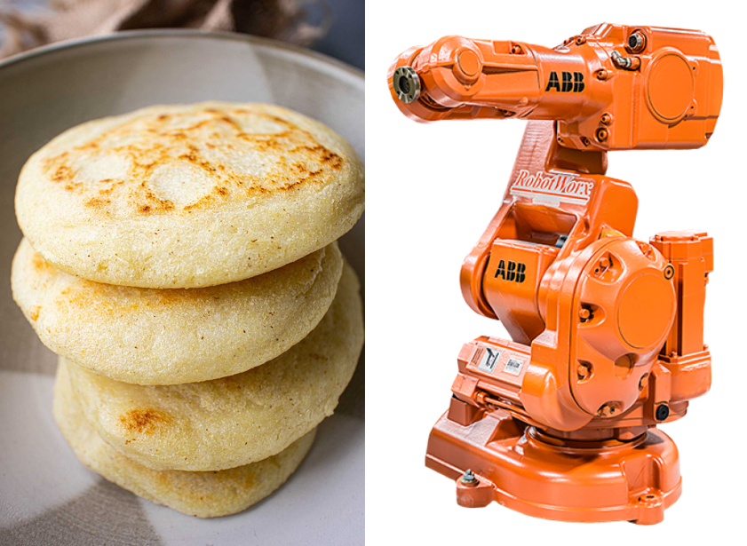
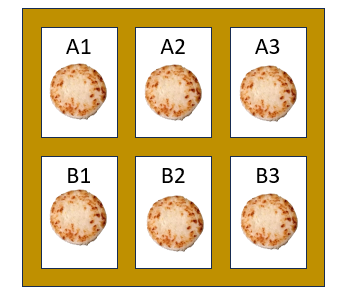
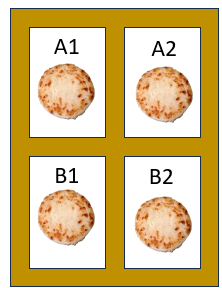
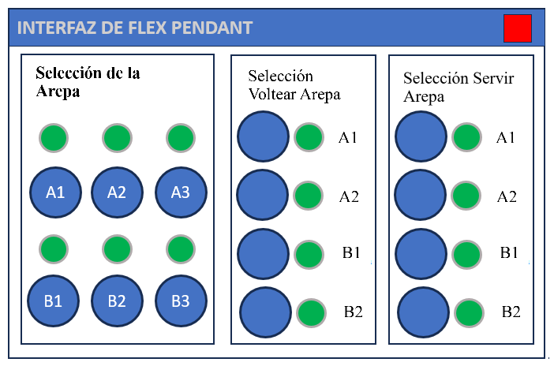
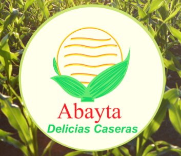
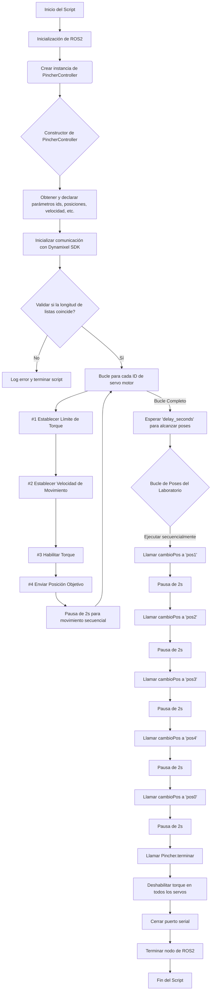

# Proyecto final (_Asador de arepas con el IRB-140_)

<p align="center">
  
</p>

**INTEGRANTES:** 
1. Jaime Andrés Martín Moreno,
2. Jorge Emilio Melo Guevara,
3. Juan David Medina Pérez,
4. Santiago Camilo Fonseca Prieto.

## Introducción del proyecto

Se nos presenta la problema de diseñar, construir e instalar una herramienta propia de tipo gripper que se pueda accionar (cierre y apertura) por medio de una señal digital conectada a una electroválvula. El objetivo general es integrarla con el manipulador IRB-140 y emplear el conjunto para implementar una rutina de recogimiento, puesta en asado y retirado del asador, para arepas.

Los objetivos específicos que se presentan en la guía del proyecto, de forma resumida, son los siguientes:
  1. Desde el manejo de una vitrina de almacenamiento de seis (6) posiciones, se deben retirar una arepa según la solicitud del operario y colocarse en la plancha de cocción, con (4) posiciones, según orden de disponibilidad.
  <p align="center">
  
</p>
  2. En función del tiempo de cocción, saber cuándo están listas las arepas y retirarse de la plancha para ser servidas.
  <p align="center">
  
</p>
  3. Desarrollar una HMI para el TeachPendant, para el cumplimiento completo de los anteriores objetivos mencionados.
<p align="center">
  
</p>

Ahora bien, varios de estos objetivos presentan problemas para su desarrollo dado el tiempo y disponibilidad de implementos, así como de espacios, para llevarlo a cabo completamente. Entre estas dificultades, destaca la de tiempo suficiente para llevarlo a cabo (se hizo realizó, al final, todo en torno a dos semanas) y de implementos: los estantes BAGGEBO mencionados para el proyecto no estuvieron disponibles, la carga del HMI fue difícil debido a la versión (algo antigua) de los robots, etc.

Esto no nos implidió continuar con el proyecto, y llevamos a cabo un trabajo que entregó resultados apropiados, ajustando los objetivos del proyecto de una manera distinta. Se presentan y luego se justifican:
  1. Desde una banda transportadora (que hace de estante), se debe retirar una arepa según la solicitud del operario y colocarse en una caja de cuatro posiciones, que hará las veces de plancha de cocción.
  2. Según la orden del operario, se debe retirar la arepa de la plancha, cuando esté lista, de forma que se recoloque de nuevo en la vitrina.
  3. Desarrollar una HMI y verificar su fucionamiento para las órdenes dichas, en simulación.

Con los objetivos anteriores, somos capaces de de generalizar el procedimiento de tal forma que se pueda realizar con varias arepas y en diferentes posicines. Identificamos la necesitados de detección de casos y memoria para el almacenamiento de los estados del robot sobre las arepas actuales en cocción en la plancha, y consideramos que dado más tiempo y espacio, se podría lograr. Así pues, solo se trabajará con una arepa para mostrar los principios de la puesta, volteada y retirada de cada arepa.

Se observa que igualmente realizamos el HMI y su funcionamiento se verifica por medio de simulación, comprobando lo anterior.


---

## Parte No.1: Proceso y consideraciones de diseño

<p align="center">
  
</p>

En un inicio, se abordó a una empresa productora de arepas (cuyo logo se muestra en la imagen) para una pequeña consulta sobre características generales sobre las arepas que hacían. Luego de la indagación, se obtuvieron los siguientes datos de sus arepas, haciendo uso de un pie de rey:

| **Arepa** | **Consistencia** | **Peso (g)** | **Medidas (cm)** |
|---|---|---|---|
| Tradicionales | Fuerte y sólida | $2\times 60$ (cascos) + $15$ (bola relleno) | $10.2 \pm 0.25$ (diámetro) + $1.5 \pm 0.2$ (grosor) |
| Típicas | Fuerte y sólida | $2\times 60$ (cascos) + $15$ (relleno) | $10.2 \pm 0.25$ (diámetro) + $1.5 \pm 0.2$ (grosor) |
| Semi-Light | Fuerte y sólida | $130$ (masa bola, sin relleno) | $13.2 \pm 0.25$ (diámetro) + $0.8 \pm 0.2$ (grosor) |
| Light | Fuerte y sólida | $125$ (masa bola, sin relleno) | $13.2 \pm 0.25$ (diámetro) + $0.8 \pm 0.2$ (grosor) |
| Semipequñas | Fuerte y sólida | $60$ (masa bola, sin relleno) | $7.3 \pm 0.25$ (diámetro) + $1.5 \pm 0.2$ (grosor) |
| Tradicional mini | Fuerte y sólida | $2\times 30$ (cascos) + $5$ (bola relleno) | $7.3 \pm 0.25$ (diámetro) + $1.5 \pm 0.2$ (grosor) |
| De arroz | Débil | $100$ (masa bola, sin relleno) | $13.2 \pm 0.25$ (diámetro) + $0.5 \pm 0.2$ (grosor) |
| De plátano | Débil | $2\times 55$ (cascos) + $10$ (relleno) | $13.2 \pm 0.25$ (diámetro) + $0.5 \pm 0.2$ (grosor) |
| De quínoa | Débil | $125$ (masa bola, sin relleno) | $13.2 \pm 0.25$ (diámetro) + $0.8 \pm 0.2$ (grosor) |
| De quínoa-q | Débil | $130$ (masa bola, sin relleno) | $13.2 \pm 0.25$ (diámetro) + $0.8 \pm 0.2$ (grosor) |
| Integrales | Débil | $125$ (masa bola, sin relleno) | $13.2 \pm 0.25$ (diámetro) + $0.8 \pm 0.2$ (grosor) |
| Yuca | Débil | $2\times 55$ (cascos) + $10$ (relleno) | $10.2 \pm 0.25$ (diámetro) + $1.5 \pm 0.2$ (grosor) |
| Dulces | Débil | $2\times 60$ (cascos) + $10$ (relleno) | $10.2 \pm 0.25$ (diámetro) + $1.5 \pm 0.2$ (grosor) |

Observe que no necesariamente coinciden con las medidas que se dieron en la tabla DH, puesto que este busca una simplificación cinemática que dadas las articulaciones y su relación espacial dé el mismo efecto del TCP que el manipulador real. Ahora bien, si se grafican con MATLAB únicamente la tabla de DH se puede ver el siguiente modelo:

<p align="center">
  
</p>

---


## Parte No.2: Manejo del _Phantom X Pincher_ con ROS2.

Antes de proceder con su manejo particular, se debe ser un poco más exacto con el vocabulario aquí y referirse al _Phantom_ en tanto manipulador y no como un robot, a pesar de que esta última acepción es válida también. La necesidad nace del hecho del controlador en particular. Si bien el hardware de control siempre es el mismo (en terminos de control y HMI), es decir el computador, el software de manejo puede variar. Según la documentación oficial hay diversas maneras de manejo tanto con software dedicado de Dynamixel como ROS2, y ROS2 en tanto _framework_ abre la posibilidad de programación tanto de rutinas, del "controlador" y de una HMI virtual para su manejo. 

Así pues, destáquese que aquí se ha procedido con el uso de Python y ROS2 en tanto framework para manejar el manipulador, de la siguiente manera:
  1. Un script de manejo de los servos en particular, para el posicionamiento y diseño de rutinas del manipulador.
  2. Un script que crea una interfaz de manejo virtual haciendo uso de la librería _Tkinter_, que vincula al anterior código.
  3. Un script que utiliza los tópicos y servicios de ROS, basándose en la estructura del Dynamixel Workbench, para controlar las articulaciones del manipulador.
  4. Un script (que es una modificación del primero) que permiten la publicación y suscripción en cada tópico de controlador por articulación.

Destaca que algunos de estos scripts se podrían integrar entre sí. De hecho, comparten muchas elementos y ocasionalmente estructuras. El motivo de esta segmentación es para mejor organización y distinción funcional, para llevar a cabo de manera secuencial los objetivos del laboratorio.

### Primer Script: Rutinas y posicionamientos particulares (`control_servo.py`).

Este es el script de manejo general y para controlar el robot manipulador. A continuación se describen las partes relevantes del mismo. Más exactamente, es un nodo de ROS2 que se encarga de la cinemática directa del manipulador _Phantom X Pincher_, manejando las articulaciones del brazo robótico mediante comandos de posición enviados a los servomotores _Dynamixel AX-12A_. El código establece la comunicación, configura los parámetros de los motores, y envía posiciones angulares objetivo a cada uno de ellos.

```python
import rclpy
from rclpy.node import Node
from dynamixel_sdk import PortHandler, PacketHandler
import time
```

Inicialmete se instanción las bibliotecas `rclpy` para la comunicación con ROS2/creación del nodo y `dynamixel_sdk` para interactuar directamente con los servomotores Dynamixel AX-12A que componen las articulaciones del robot. `PacketHandler` y `PortHandler` son clases de esa segunda biblioteca para manejar la comunicación serial y la creación de paquetes de datos para los servomotores Dynamixel.

```python
ADDR_TORQUE_ENABLE    = 24
ADDR_GOAL_POSITION    = 30
ADDR_MOVING_SPEED     = 32
ADDR_TORQUE_LIMIT     = 34
ADDR_PRESENT_POSITION = 36
```

Acto seguido se declaran las direcciones de registro, con diferentes finalidades del código. En orden: para habilitar o deshabilitar el torque del motor, para escribir la posición angular objetivo, para controlar la velocidad del movimiento, para establecer el límite máximo de torque y para leer la posición angular actual del motor.

Inmediatamente después se da el código del nodo: se declara la clase `PincherController`y se definen sus elementos (no se muestran aquí por extensión, pero se describen sus funciones). En esta se inicializa el nodo, se declaran los parámetros configurables (`port`, `baudrate`, `dxl_ids`, `goal_positions`, `moving_speed`, `torque_limit` y `delay`); de entre ellos es fácil deducir su función, a excepción de `dxl_ids`. Este último es una lista de los IDs de los servomotores del robot (ej. [1, 2, 3, 4, 5]). Después de hacer el manejo de la comunicación, la validación, se pasa al siguiente bloque:

```python
# 1) Configurar torque_limit, velocidad y enviar posición a cada servo
for dxl_id, goal in zip(dxl_ids, goal_positions):
    # Limitar torque
    packet.write2ByteTxRx(port, dxl_id, ADDR_TORQUE_LIMIT, torque_limit)
    # Limitar velocidad
    packet.write2ByteTxRx(port, dxl_id, ADDR_MOVING_SPEED, moving_speed)
    # Habilitar torque
    packet.write1ByteTxRx(port, dxl_id, ADDR_TORQUE_ENABLE, 1)
    # Enviar posición objetivo
    packet.write2ByteTxRx(port, dxl_id, ADDR_GOAL_POSITION, goal)
    self.get_logger().info(f'[ID {dxl_id}] → goal={goal}, speed={moving_speed}, torque_limit={torque_limit}')
    time.sleep(2)

# 2) (Opcional) Leer y mostrar posición actual
for dxl_id in dxl_ids:
    pos, _, _ = packet.read2ByteTxRx(port, dxl_id, ADDR_PRESENT_POSITION)
    self.get_logger().info(f'[ID {dxl_id}] posición actual={pos}')

# 3) Esperar a que todos los servos alcancen la posición
self.get_logger().info(f'Esperando {delay_seconds}s para completar movimiento...')
time.sleep(delay_seconds)

# 4) Apagar torque en todos los servos
def terminar(self):
for dxl_id in self.dxl_ids:
    self.packet.write1ByteTxRx(self.port, dxl_id, ADDR_TORQUE_ENABLE, 0)

# 5) Cerrar puerto y terminar nodo
self.port.closePort()
rclpy.shutdown()
```

Este bloque de dos bucles y uno de espera tienen como objetivo iterar sobre cada motor para realizar la siguiente secuencia de acciones, con el fin de llevar paso a paso el movimiento del manipulador:
  1. Configura el `torque_limit` y el `moving_speed` de cada motor.
  2. Habilita el torque (`TORQUE_ENABLE`) en cada servomotor.
  3. Envía la posición objetivo (`GOAL_POSITION`) a cada motor para iniciar el movimiento.
  4. Lee la posición actual del motor y la imprime en el log del nodo.
  5. Se introduce una pausa, esperando que todas las posiciones se hayan enviado con el fin de permitir que todos los motores alcanzen su posición final.
  6. Se deshabilita el torque en todos los servos.
  7. Se cierra el puerto y se apaga el nodo.
       
Este bloque de instrucciones se complementa, luego, con los siguientes para poder generar una rutina:

```python
    def cambioPos(self, newPos):
        if len(newPos) != len(self.dxl_ids):
            self.get_logger().error("La nueva posición debe tener la misma longitud que dxl_ids")
            return

        self.goal_positions = newPos

        for dxl_id, goal in zip(self.dxl_ids, self.goal_positions):
            self.packet.write2ByteTxRx(self.port, dxl_id, ADDR_GOAL_POSITION, goal)
            self.get_logger().info(
                f'[ID {dxl_id}] → goal={goal}, speed={self.moving_speed}, torque_limit={self.torque_limit}'
            )
            time.sleep(2)
```

Este método permite cambiar la posición del robot a una nueva configuración. Valida la longitud de la nueva lista de posiciones, itera sobre cada motor y envía la nueva posición objetivo (`GOAL_POSITION`). Luego de esto vienen las funciones principales donde se puede programar la plantilla de la rutina como tal, jugando con listas de posiciones y llamado de métodos. Aquí un ejemplo de una en particular: 

```python
def main(args=None):
    rclpy.init(args=args)
    Pincher = PincherController()
    pos0 = [512, 512, 512, 512, 512] 
    pos1 = [582, 582, 568, 454, 512]
    pos2 = [412, 610, 426, 596, 512]
    pos3 = [753, 454, 667, 582, 512]
    pos4 = [738, 412, 667, 383, 512]

    '''time.sleep(2)
    Pincher.cambioPos(pos1)
    time.sleep(2)
    Pincher.cambioPos(pos2)
    time.sleep(2)
    Pincher.cambioPos(pos3)
    time.sleep(2)
    Pincher.cambioPos(pos4)
    time.sleep(2)
    Pincher.cambioPos(pos0)
    Pincher.terminar()
    #while True:'''

if __name__ == '__main__':
    main()
```

Ahora, un diagrama de flujo de todas estas acciones de este script:



Es necesario mencionar que esta rutina ejemplo en particular será la empleada para llevar a cabo la tarea del laboratorio que solicita que se probaran las poses generadas por:
  - $0$, $0$, $0$, $0$, $0$.
  - $25$, $25$, $20$, $-20$, $0$.
  - $-35$, $35$, $-30$, $30$, $0$.
  - $85$, $-20$, $55$, $25$, $0$.
  - $80$, $-35$, $55$, $-45$, $0$.

Esto se mostrará en el video del final.

---


### Segundo Script: HMI (`pincher_gui.py`).

El script `pincher_gui.py` es una interfaz de usuario (GUI) creada con la biblioteca _Tkinter_ de Python, diseñada para manejar el manipulador en cuestión. Su propósito principal es proporcionar una manera visual e interactiva de enviar comandos de posición a las articulaciones del robot, utilizando ROS (Robot Operating System) y una clase de controlador (PincherController).

Dado que la finalidad de este laboratorio no va sobre el trabajo con esta librería, y no tiene relevancia para los objetivos, se describe su funcionamiento de forma breve y resumida mostrando solo algo del código (aquel que comunica con el nodo de ROS2).

El código de la GUI importa varias bibliotecas aparte de _Tkinter_ para la creación de la interfaz gráfica como _rclpy_ para la comunicación con ROS y _PincherController_ (el script anteriormente explicado) como módulo local para manejar la lógica de control del robot. La biblioteca `threading` se usa para ejecutar el movimiento del robot en un hilo separado, lo que evita que la GUI se congele mientras el robot se mueve.

Se definen unas posiciones predefinidas (`preset_positions`) en un diccionario almacena cinco poses o configuraciones de articulaciones predeterminadas para el robot. Estas poses se corresponden con las poses de home y las otras cuatro requeridas (mencionadas anteriormente)
  
Sobre la interfaz como tal, se crea una ventana principal con el título "Control de Robot Pincher". En la cabecera se contiene información de identificación, como el nombre de la universidad, el curso ("Robótica 2025-1"), nuestros nombres y el logo de la universidad (UNAL).

Se crea un marco (LabelFrame) titulado "Poses Dadas" que contiene un botón por cada una de las cinco poses predefinidas. Al hacer clic en un botón, se llama a la función `mover_a` con la posición correspondiente, lo que inicia el movimiento del robot. 

```python
# ======= BOTONES DE POSICIÓN =========
frame_botones = tk.LabelFrame(ventana, text="Poses Dadas", fg="#00ff88", bg="#2e2e2e", font=("Helvetica", 12, "bold"), padx=10, pady=10)
frame_botones.pack(pady=10, padx=20, fill="x")

def mover_a(posicion):
    def _thread():
        pincher.cambioPos(posicion)
    threading.Thread(target=_thread).start()

for nombre, posicion in preset_positions.items():
    b = tk.Button(frame_botones, text=nombre, width=30, bg="#00ff88", fg="black", command=lambda p=posicion: mover_a(p))
    b.pack(pady=4)
```

Sin embargo también está el marco "Pose Manual" que permite al usuario ingresar sus propios valores de posición para las cinco articulaciones, separados por comas. Al presionar el botón "Enviar a pose", el programa valida la entrada y envía los valores al robot.

```python
# ======= POSICIÓN PERSONALIZADA =========
frame_personalizado = tk.LabelFrame(ventana, text="Pose Manual" , fg="#00ff88", bg="#2e2e2e", font=("Helvetica", 12, "bold"), padx=10, pady=10)
frame_personalizado.pack(padx=20, fill="x")

entrada = tk.Entry(frame_personalizado, width=50)
entrada.pack(pady=5)
entrada.insert(0, "512,512,512,512,512")

def enviar_personalizado():
    texto = entrada.get()
    try:
        valores = [int(x.strip()) for x in texto.split(',')]
        if len(valores) != 5:
            raise ValueError
        mover_a(valores)
    except:
        messagebox.showerror("Error", "Ingresa 5 números separados por comas")

boton_custom = tk.Button(frame_personalizado, text="Enviar a pose", bg="#00ff88", fg="black", command=enviar_personalizado)
boton_custom.pack(pady=5)
```

Se observa algo relevante: la función `mover_a` utiliza `threading` para ejecutar la operación de movimiento (`pincher.cambioPos(posicion)`) en segundo plano. 

---

### Tercer Script: Control de articulaciones con tópicos y servicios de ROS (`topics_and_services.py`).

```python
import rclpy
from rclpy.node import Node
import time
from dynamixel_workbench_msgs.msg import JointCommand
from dynamixel_workbench_msgs.srv import SetPosition
```

Este script destaca sobre los anteriores porque controla el manipulador utilizando la interfaz de `dynamixel_workbench`. La comunicación se realiza a través de tópicos para comandos en conjunto y servicios para movimientos individuales.

Al igual que los anteriores, crea un nodo de ROS aquí llamado `PincherRosController` que se ejecuta en el espacio de trabajo ROS.

Después de inicializar el nodo, se configuran las articulaciones, se crea el publicador y el cliente de servicio:

```python
 # Se añaden los nombres en base a las ID's
        self.joint_names = ['waist', 'shoulder', 'elbow', 'wrist', 'gripper']
        self.joint_ids = [1, 2, 3, 4, 5]

        self.publisher_ = self.create_publisher(JointCommand, 'dynamixel_workbench/joint_command', 10)
        self.get_logger().info('Publicador creado para el tópico dynamixel_workbench/joint_command')

        # 2. Crear un cliente para llamar a un servicio (y el servicio SetPosition permite enviar un comando a un solo servo por ID).
        self.set_pos_client = self.create_client(SetPosition, 'dynamixel_workbench/set_position')
        while not self.set_pos_client.wait_for_service(timeout_sec=1.0):
            self.get_logger().info('Servicio /dynamixel_workbench/set_position no disponible, esperando...')
        self.get_logger().info('Cliente de servicio creado para /dynamixel_workbench/set_position')
```
Con esto basta para definir métodos que permiten comunicación a través de tópicos y servicios. Se definen dos métodos en particular:

```python
    def send_joint_positions_by_topic(self, positions):

        if len(positions) != len(self.joint_ids):
            self.get_logger().error('El número de posiciones no coincide con el número de articulaciones.')
            return

        msg = JointCommand()
        msg.joint_name = self.joint_names
        msg.position = [float(p) for p in positions]  # Las posiciones deben ser floats
        
        self.publisher_.publish(msg)
        self.get_logger().info('Publicando comando de posición en el tópico.')
        self.get_logger().info(f'Posiciones enviadas: {positions}')

    def set_single_joint_position_by_service(self, joint_id, position):

        request = SetPosition.Request()
        request.id = joint_id
        request.position = position

        future = self.set_pos_client.call_async(request)
        self.get_logger().info(f'Llamando al servicio para mover el ID {joint_id} a la posición {position}')
        
        rclpy.spin_until_future_complete(self, future)
        
        if future.result() is not None and future.result().result:
            self.get_logger().info(f'Servicio ejecutado con éxito para el ID {joint_id}.')
        else:
            self.get_logger().error(f'Fallo al llamar al servicio para el ID {joint_id}.')
```

El primero de estos métodos, el de tópicos, crea un _mensaje_ `JoinCommand` y llena el mensaje con los nombres y las posiciones de todas las articulaciones. Luego llama a `self.publisher_.publish(msg)` para enviar la instrucción de movimiento de manera asíncrona a todos los motores a la vez, lo cual es ideal para movimientos coordinados.

El segundo, de servicios, crea una _solicitud_ (`request`) para el servicio `SetPosition`. Define la ID del servo y la posición deseada para la solicitud, y cuando está listo la envía al servicio, y `rclpy.spin_until_future_complete` hace que el cliente espere hasta recibir una respuesta del servidor.

Finalmente se tiene el `main`:

```python
def main(args=None):
    rclpy.init(args=args)
    controller = PincherRosController()

    # Poses de ejemplo
    home_pose = [512, 512, 512, 512, 512]
    pose_1 = [582, 582, 568, 454, 512]
    
    try:
        # Ejemplo de movimiento usando el tópico (preferido para movimientos secuenciales/continuos)
        controller.get_logger().info('Moviendo a la pose HOME usando el tópico.')
        controller.send_joint_positions_by_topic(home_pose)
        time.sleep(3)
        controller.get_logger().info('Moviendo a la Pose 1 usando el tópico.')
        controller.send_joint_positions_by_topic(pose_1)
        time.sleep(3)

        # Ejemplo de movimiento de un solo servo usando un servicio
        controller.get_logger().info('Moviendo solo el servo del hombro (ID 2) a 600 usando el servicio.')
        controller.set_single_joint_position_by_service(2, 600)
        time.sleep(3)

    except Exception as e:
        controller.get_logger().error(f'Ocurrió un error: {e}')
    finally:
        controller.destroy_node()
        rclpy.shutdown()

if __name__ == '__main__':
    main()
```
Más allá de la inicialización de la biblioteca de ROS y la instancia del controlader, observe que define dos poses de ejemplo. Funciona de tal forma que muestra, por medio de estructuras _try_ moviendo el manipluador del `home` a esa `pose1`. Finalmente hay una pequeña estructura _catch_ en el caso de un error y al finalizar este procedimiento termina el script.

---

### Cuarto Script: Suscripción y publicación por tópicos (`control_servo_MOD.py` y `pincher_gui_MOD.py`).

En el caso de `pincher_gui_MOD.py` se introduce una nueva clase que hereda que hereda de `rclpy.node.Node` y utiliza un publicador para enviar comandos a un tópico de ROS llamado `'dynamixel_workbench/joint_command'`. Por otra parte, también usa `JointCommand` para enviar las posiciones de las articulaciones a través de un tópico de ROS, especificando los nombres de las articulaciones y las posiciones. Como extras:
  - Se añade un hilo separado (`ros_thread`) para ejecutar `rclpy.spin()` sobre el nodo del controlador en `pincher_gui_MOD.py`, lo que permite que la interfaz gráfica (GUI) no se bloquee mientras el nodo ROS está activo. En el archivo original, el control del robot no se ejecuta en un hilo separado de `rclpy.spin()`.
  -  La función `mover_a` en `pincher_gui_MOD.py` llama al método `pincher.send_joint_positions_by_topic()`, que publica en el tópico de ROS. La versión original llama a `pincher.cambioPos()`, que escribe directamente en el puerto del servo.

Con lo anterior, se cumple el requisito de publicación al l crear un publicador que envía comandos de posición a un tópico de control de articulación de ROS.

---

## Parte No.3: Prueba Física.

El manipulador en particular con el cual se hicieron los testeos y pruebas correspondientes es el siguiente:

<p align="center">
  
</p>

Que muestra el siguiente plano de planta (con algunas medidas relevantes para su manejo):

<p align="center">
  
</p>

En el siguiente video se muestran los resultados: [Link al video de a la demostración en youtube.](https://youtu.be/7Tnz1caRR-I)


