# Proyecto final (_Asador de arepas con el IRB-140_)

  

**INTEGRANTES:** 
1. Jaime Andrés Martín Moreno,
2. Jorge Emilio Melo Guevara,
3. Juan David Medina Pérez,
4. Santiago Camilo Fonseca Prieto.

## Introducción del proyecto

Se nos presenta la problema de diseñar, construir e instalar una herramienta propia de tipo gripper que se pueda accionar (cierre y apertura) por medio de una señal digital conectada a una electroválvula. El objetivo general es integrarla con el manipulador IRB-140 y emplear el conjunto para implementar una rutina de recogimiento, puesta en asado y retirado del asador, para arepas.

Los objetivos específicos que se presentan en la guía del proyecto, de forma resumida, son los siguientes:
  1. Desde el manejo de una vitrina de almacenamiento de seis (6) posiciones, se deben retirar una arepa según la solicitud del operario y colocarse en la plancha de cocción, con (4) posiciones, según orden de disponibilidad.
  

  

  2. En función del tiempo de cocción, saber cuándo están listas las arepas y retirarse de la plancha para ser servidas.
  

  

  3. Desarrollar una HMI para el TeachPendant, para el cumplimiento completo de los anteriores objetivos mencionados.

  

Ahora bien, varios de estos objetivos presentan problemas para su desarrollo dado el tiempo y disponibilidad de implementos, así como de espacios, para llevarlo a cabo completamente. Entre estas dificultades, destaca la de tiempo suficiente para llevarlo a cabo (se hizo realizó, al final, todo en torno a dos semanas) y de implementos: los estantes BAGGEBO mencionados para el proyecto no estuvieron disponibles, la carga del HMI fue difícil debido a la versión (algo antigua) de los robots, etc.

Esto no nos implidió continuar con el proyecto, y llevamos a cabo un trabajo que entregó resultados apropiados, ajustando los objetivos del proyecto de una manera distinta. Se presentan y luego se justifican:
  1. Desde una banda transportadora (que hace de estante), se debe retirar una arepa según la solicitud del operario y colocarse en una caja de cuatro posiciones, que hará las veces de plancha de cocción.
  2. Según la orden del operario, se debe retirar la arepa de la plancha, cuando esté lista, de forma que se recoloque de nuevo en la vitrina.
  3. Desarrollar una HMI y verificar su funcionamiento para las órdenes dichas, en simulación.

Con los objetivos anteriores, somos capaces de de generalizar el procedimiento de tal forma que se pueda realizar con varias arepas y en diferentes posicines. Identificamos la necesitados de detección de casos y memoria para el almacenamiento de los estados del robot sobre las arepas actuales en cocción en la plancha, y consideramos que dado más tiempo y espacio, se podría lograr. Así pues, solo se trabajará con una arepa para mostrar los principios de la puesta, volteada y retirada de cada arepa.

Se observa que igualmente realizamos el HMI y su funcionamiento se verifica por medio de simulación, comprobando lo anterior.

---

## Parte No.1: Proceso y consideraciones de diseño de la herramienta

  

En un inicio, se abordó a una empresa productora de arepas (cuyo logo se muestra en la imagen) para una pequeña consulta sobre características generales sobre las arepas que hacían. Luego de la indagación, se obtuvieron los siguientes datos de sus arepas, haciendo uso de un pie de rey:

| **Arepa** | **Consistencia** | **Peso (g)** | **Medidas (cm)** |
|---|---|---|---|
| Tradicionales | Fuerte y sólida | $2\times 60$ (cascos) + $15$ (bola relleno) | $10.2 \pm 0.25$ (diámetro) + $1.5 \pm 0.2$ (grosor) |
| Típicas | Fuerte y sólida | $2\times 60$ (cascos) + $15$ (relleno) | $10.2 \pm 0.25$ (diámetro) + $1.5 \pm 0.2$ (grosor) |
| Semi-Light | Fuerte y sólida | $130$ (masa bola, sin relleno) | $13.2 \pm 0.25$ (diámetro) + $0.8 \pm 0.2$ (grosor) |
| Light | Fuerte y sólida | $125$ (masa bola, sin relleno) | $13.2 \pm 0.25$ (diámetro) + $0.8 \pm 0.2$ (grosor) |
| Semipequñas | Fuerte y sólida | $60$ (masa bola, sin relleno) | $7.3 \pm 0.25$ (diámetro) + $1.5 \pm 0.2$ (grosor) |
| Tradicional mini | Fuerte y sólida | $2\times 30$ (cascos) + $5$ (bola relleno) | $7.3 \pm 0.25$ (diámetro) + $1.5 \pm 0.2$ (grosor) |
| De arroz | Débil | $100$ (masa bola, sin relleno) | $13.2 \pm 0.25$ (diámetro) + $0.5 \pm 0.2$ (grosor) |
| De plátano | Débil | $2\times 55$ (cascos) + $10$ (relleno) | $13.2 \pm 0.25$ (diámetro) + $0.5 \pm 0.2$ (grosor) |
| De quínoa | Débil | $125$ (masa bola, sin relleno) | $13.2 \pm 0.25$ (diámetro) + $0.8 \pm 0.2$ (grosor) |
| De quínoa-q | Débil | $130$ (masa bola, sin relleno) | $13.2 \pm 0.25$ (diámetro) + $0.8 \pm 0.2$ (grosor) |
| Integrales | Débil | $125$ (masa bola, sin relleno) | $13.2 \pm 0.25$ (diámetro) + $0.8 \pm 0.2$ (grosor) |
| Yuca | Débil | $2\times 55$ (cascos) + $10$ (relleno) | $10.2 \pm 0.25$ (diámetro) + $1.5 \pm 0.2$ (grosor) |
| Dulces | Débil | $2\times 60$ (cascos) + $10$ (relleno) | $10.2 \pm 0.25$ (diámetro) + $1.5 \pm 0.2$ (grosor) |

Después de hacer una revisión, para los pesos y la resistencia consideramos que el PLA propio de la impresora 3D sería suficinete para funcionar con una arepa real en las peores condiciones (mayor tamaño, peso, y consistencia débil). Se diseña la herramienta anticipando que pueda incluir la más, pudiendo recoger la más pequeña también. Se muestra a continuación una idea del gripper que la guía sugiría:

  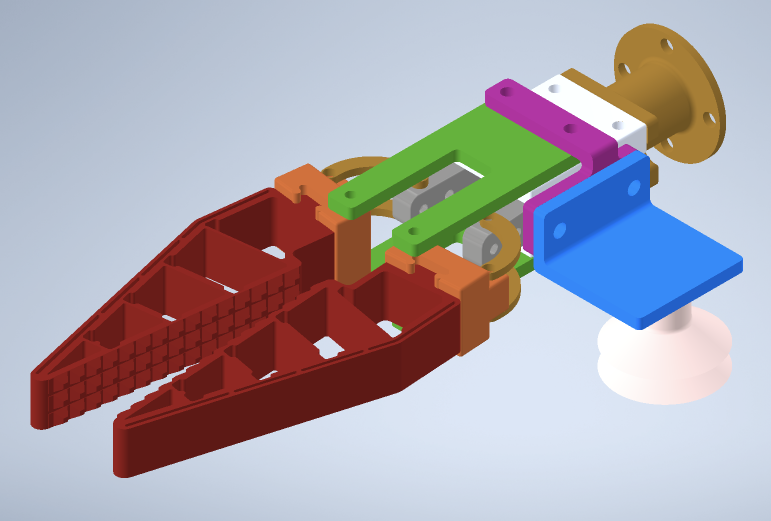

Como se puede observar, los laterales de las pinzas no parecen tener un agarre lo suficientemente seguro. Así pues, por lo menos nuestro diseño tendrá una base inferior para que el agarre por fricción no sea necesario. Los materiales también son muy débilaes para poder levantar y desplazar algo con la inercia de una arepa, de forma que se considera para nuestro diseño emplear toda la herramienta de PLA con capa gruesa. Finalmente, se piensa para nuestro diseño que esta herramienta sea capaz de realizar todas las acciones necesarias sobre la arepa (recogida, puesta, desplazamiento en el aire). Sumado a esto, se considera el hechod de que la acción de cierre y apertura se realizará con un actuador pinza neumática que se presta en el laboratorio, cuya foto se muestra a continuación:

  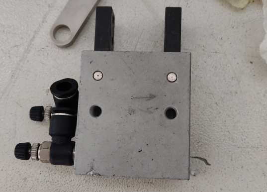

Que se debe conectar a la siguiente electroválvula 5/2:

  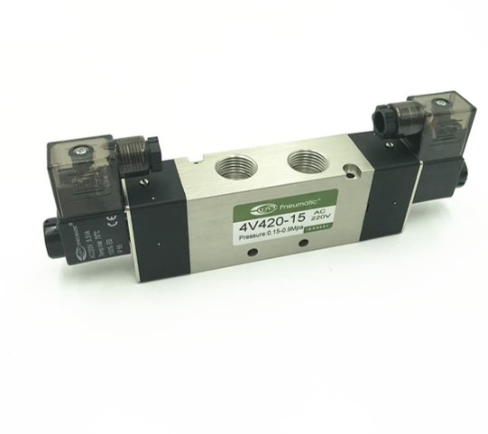

La pinza neumática debe ser adaptado en la base de la herramienta que diseñemos. Así, después de haberla limpiado, le tomamos medidas suficientes y fueron usadas para el diseño.

El resultado, modelo por modelo, fue el siguiente: primero, se diseñó la base que se utilizaría parara atornillar al flange del IRB-140:

  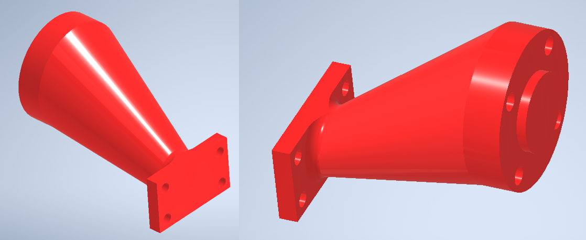

Luego, se hizo un pequeño modelo de la pinza neumática con unos ejes para que se pudieran ensamblar con las pinzas de arepas, principales:

  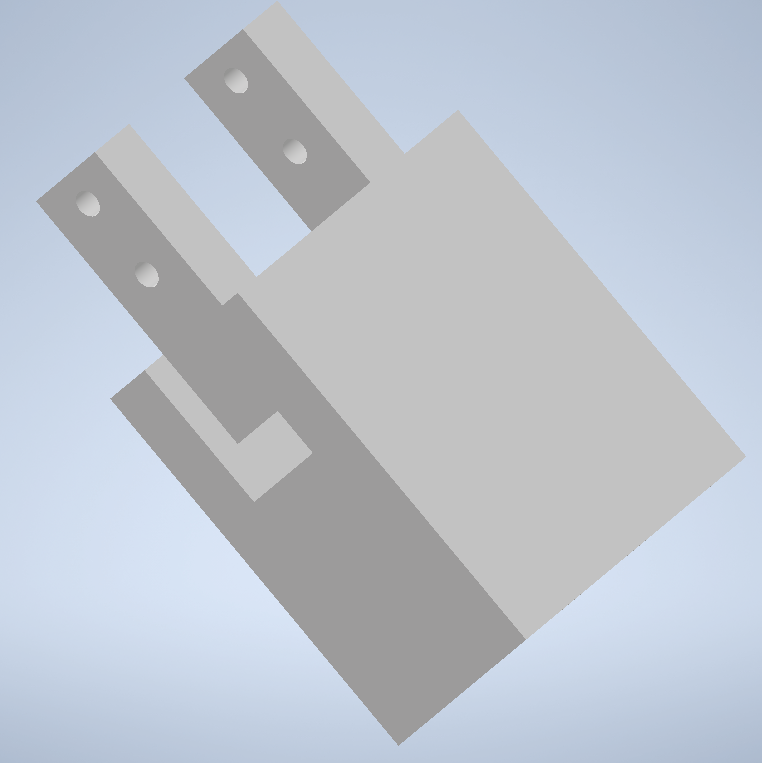

Finalmente, el diseño de las pinzas para la arepa, teniendo en cuenta todas las consideraciones mencionadas:

  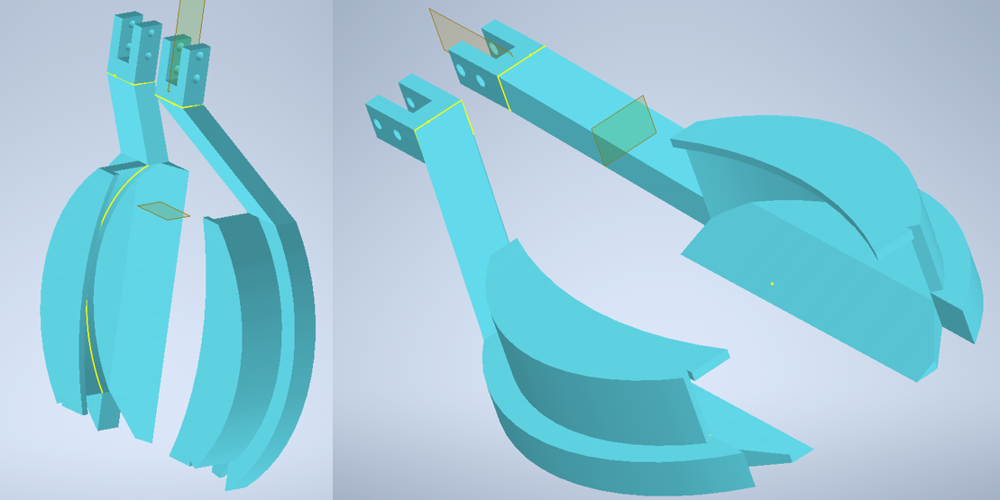

Y un pequeño modelo de arepa del mayor tamaño posible para evidenciar en el modelo:

  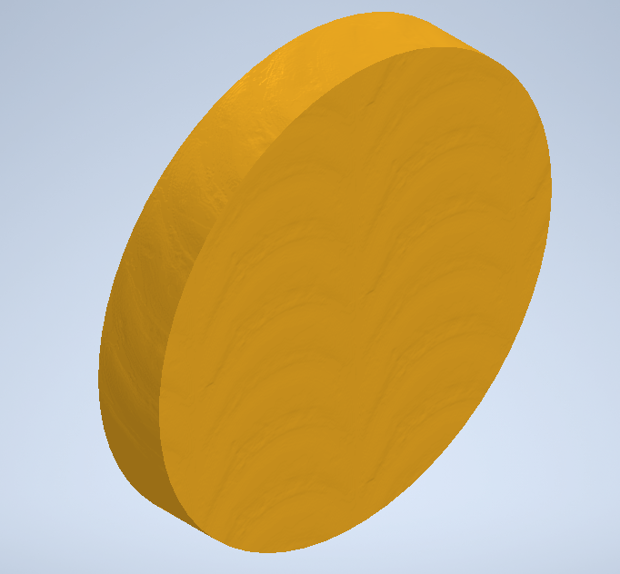

Se ve, así, el conjunto ensamblado:

  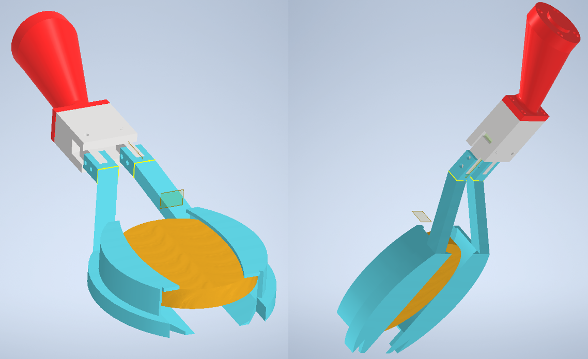

---

## Parte No.2: Rutina a realizar (RobotStudio).

La rutina a realizar se encuentra en el módulo adjunto. Se describe a continuación su flujo general.

En un principio. Es necesario tener en cuenta que el código se compone de dos partes:
  1. El arbol de decisiones diseñado para ser operado con tres (3) botones de entrada digital.
  2. El arbol de decisiones diseñado para ser operado con el TeachPendant, que cuenta con doce (12) entradas digitales.

El motivo de esta fragmentación es la dificultad de cargar el HMI diseñado para el _TeachPendant_ al robot. Las entradas, pues, se asocian con esos botones de pantalla táctil. Debido a que este camino es el ideal, pero no es posible, para la muestra funcional se muestra la operación con botones, que se limita a tres entradas. Sin embargo, se explican a continuación ambos. 

En un principio, ambos árboles están integrados en el mismo módulo y se pueden utilizar de forma independiente sin que el otro interfiera, de forma que en la muestra funcional se encuentra cargado pero inactivo el arbol relativo al _TeachPendant_. Dada esta distinción, también es posible realizar diagramas de flujo por separado para ambas rutinas. Se muestra, primero, el relativo al de los botones:

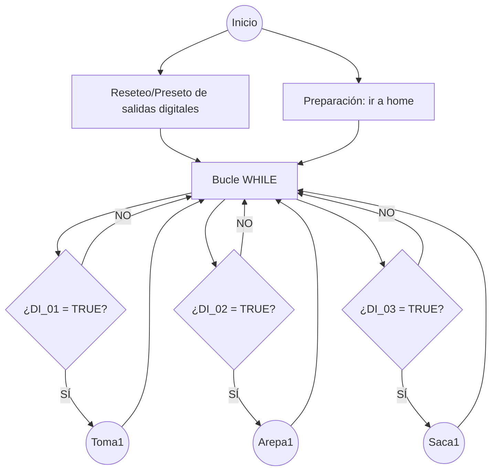

El diagrama y subdiagramas de flujo del arbol que hace uso del _TeachPendant_ es el siguiente:

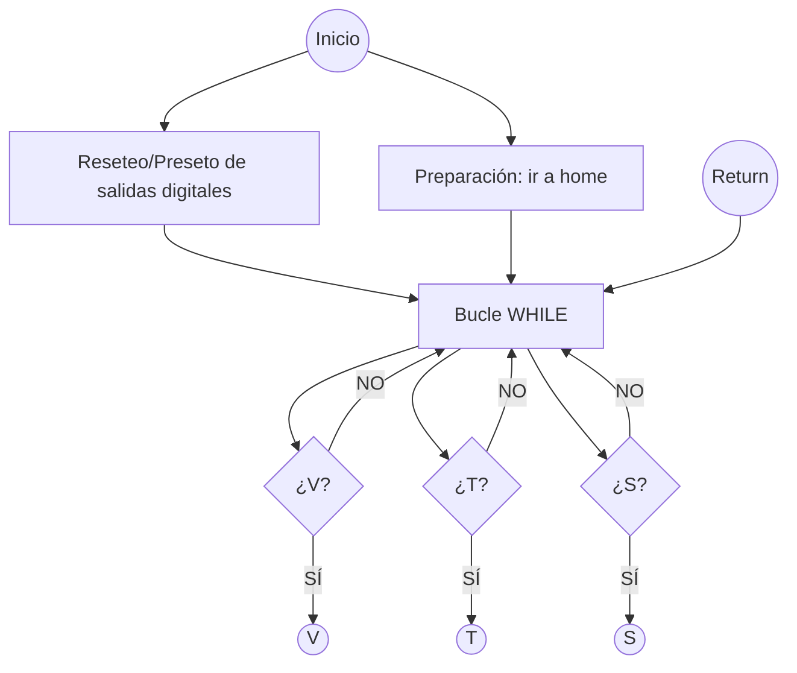
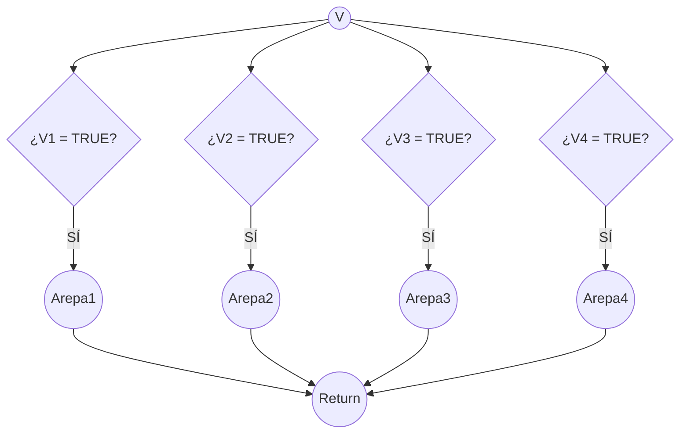
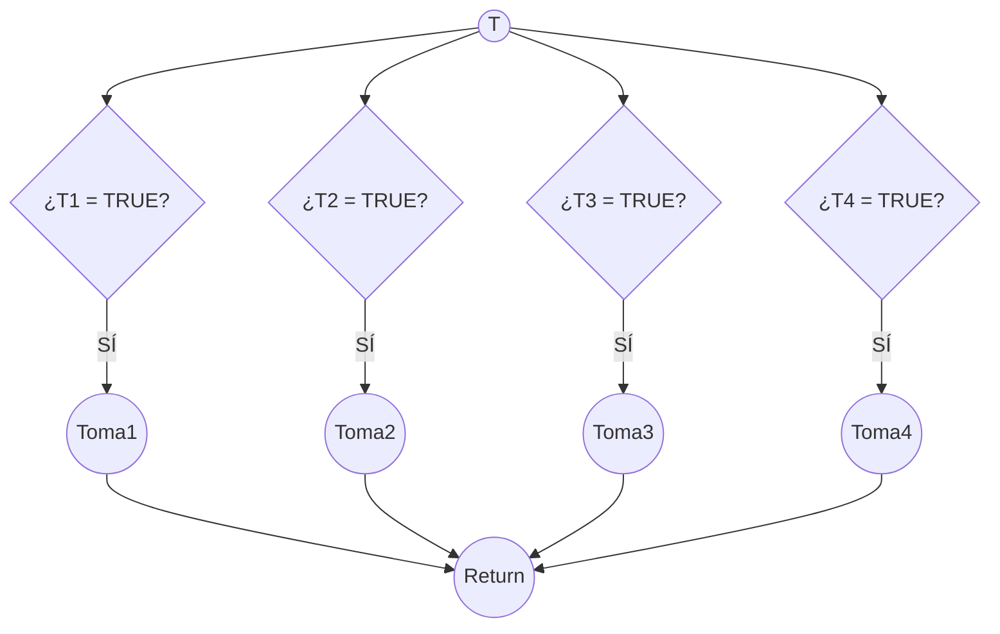
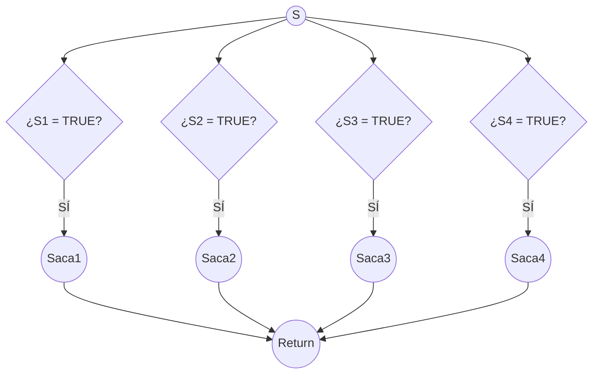

Ahora bien, nótese que los nodos circulares llevan a _procedures_ (grupos de trayectorias, rutinas particulares), y se agrupan de la siguiente manera:

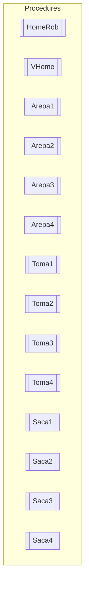

Debido a la secuencialidad del código, y a su manera simpleza, se omite su puesta aquí para su descripción. Basta decir lo siguiente, que muestra cómo funciona cada procedimiento declarado de trayectorias:
  - Cada uno juega con dos salidas digitales en particular: `DI_05` para el accionamiento del cierre de la pinza y `DI_06` para el accionamiento de la apertura de la pinza.
  - Funciones `WaitTime` generalmente de $2$ segundos para asegurar posicionamiento correcto y finalización segura de cada proceso.
  - Empleo de una velocidad de movimiento de $100\>mm/s$.
  - $10\>mm$ de zona de error o aproximación.
  - Coordenadas (_targets_) y trayectorias relativas al _WorkObject_ definido

---

## Parte No.3: Conexiones y arreglo de los elementos en el espacio de trabajo

  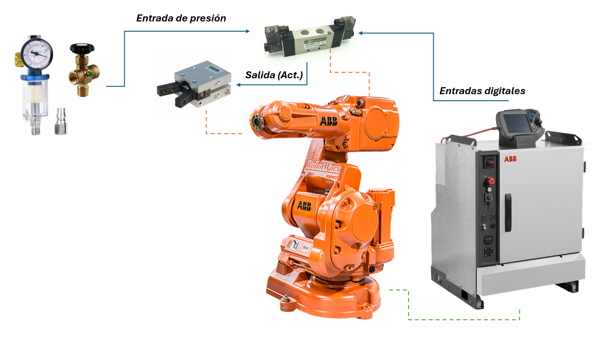

Ya esté cargado el módulo de RAPID al robot y estén situados los elementos, como la caja que hará la plancha con su arepa modelo y la banda transportadora a una cercanía apropiada, se ajusta la herramienta con la pinza neumática. Entonces, se vuelve necesario ubicar la electroválvula y conectarla con:
  -Las entradas digitales.
  -Las entradas de presión (desde una red neumática, con mangueras se obtuvo el aire comprimido de $6mm$ y $8mm$ con reductores).
  -La pinza neumática (con dos entradas, una para abrir y otra para cerrar).

  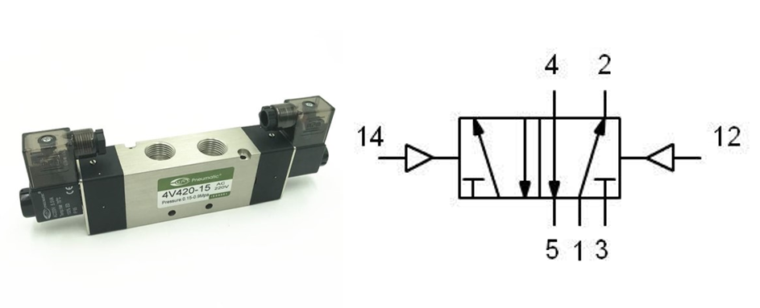

Obsérvese el diagrama de la electroválvula. Para conectar esta electroválvula 5/2 (5 vías, 2 posiciones) se siguieron estos pasos:

_Primero_, se tuvo la electroválvula 5/2 y se identificaron las conexiones de la siguiente forma:
   - **No.1 (Presión)**: Entrada de aire comprimido desde la fuente [P].
   - **No.2 y No.4**: Salidas de presión, hacia la pinza neumática (No.2 para abrir, No.4 para cerrar) [A y B].
   - **No.3 y No.5**: Conexiones de escape de aire (que se dejaron libres sin silenciadores) [R y S].
   - **Señal eléctrica**: Conecta los cables de la electroválvula a tu control (24V).
   - **No.12 y No.14**: Entradas eléctricas, digitales.
Se explica brevemente el funcionamiento de este actuador:
  - Las líneas con una pequeña "T" al final indican que son escapes silenciados o sin conexión para recuperación.
  - Cada cuadro representa una posición de la válvula. El diagrama muestra dos cuadros, indicando dos posiciones.
  - El motivo de los números "14" y "12" es dados los símbolos por tipo de solenoide: el "14" es el símbolo de un solenoide con retorno por muelle (o fuerza pilotada por muelle) y cuando se energiza el solenoide conectado a la vía 14, la válvula cambia a la posición derecha; por otra parte, el "12" va haca la posición izquierda.
  - Para la posición del cuadro de la izquierda:
      - El aire entra por 1 y fluye hacia 2.
      - La vía 4 está conectada al escape 5.
      - La vía 3 está bloqueada o es un escape de la vía 2 (aunque aquí se muestra como escape de la 2).
  - Para la posición del cuadro de la derecha:
      - El aire entra por 1 y fluye hacia 4.
      - La vía 2 está conectada al escape 3.
      - La vía 5 está bloqueada o es un escape de la vía 4.

_Segundo_, se conectó la fuente de aire a la entrada de presión de la electroválvula a la línea de aire comprimido. 
_Tercero_, se conectó la pinza neumática, tal que el puerto se unió el puerto A de la electroválvula a una entrada de la pinza, y el puerto B a la otra entrada de la pinza. 
_Cuarto_, se hizo una prueba de funcionamiento: Al energizar la electroválvula, el aire debería fluir de **P → A** y escapará por **B → S**, moviendo la pinza en una dirección y al desenergizar (o cambiar la posición, dependiendo del tipo de válvula), el aire fluirá de **P → B** y escapará por **A → R**, moviendo la pinza en sentido contrario. Si ocurría lo contrario, se invertían las conexiones en las entadas de la pinza.

Ya habiendo realizado estos pasos, se tiene el robot listo para realizar las operaciones:

  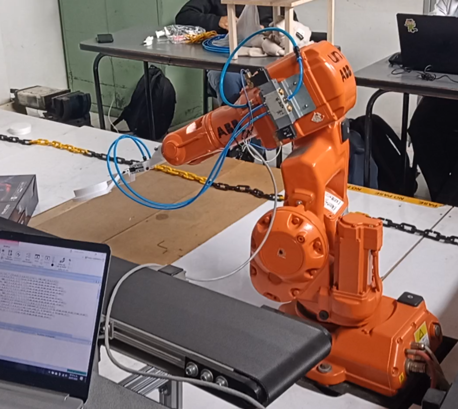

---

## Parte No.4: Resultados

Se refiere aquí una vez más a los dos árboles de acciones que presentaba el módulo: uno para la prueba física, con botones, y otra con el _TeachPendant_ que no se podía realizar en físico. No por eso se mostrará solamente el funcionamiento del primer arbol, sino que se mostrará el del _TeachPendant_ por medio de una simulación en _RobotStudio_.

El HMI resultante fue el siguiente:

  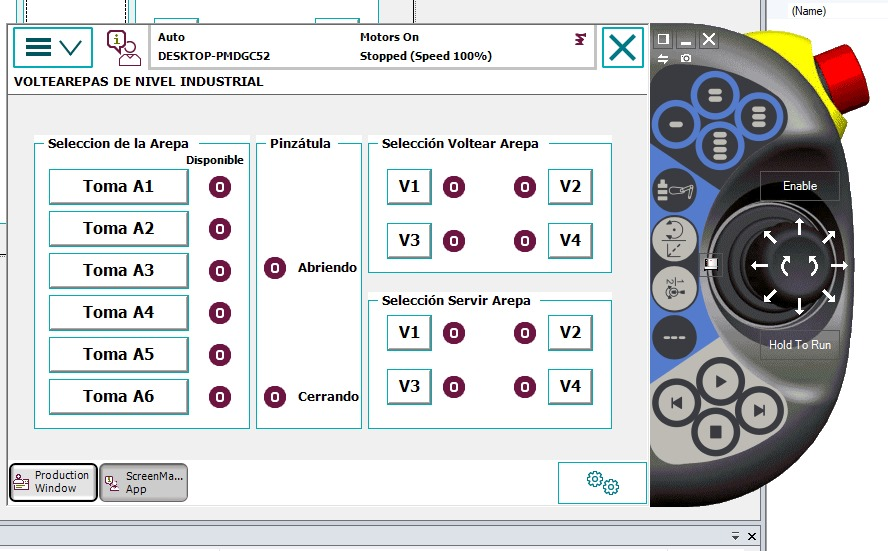

En el siguiente video se muestra la simulación y los resultados físicos: [Link al video de a la demostración en youtube.](https://youtu.be/96cTgR2HVno)

